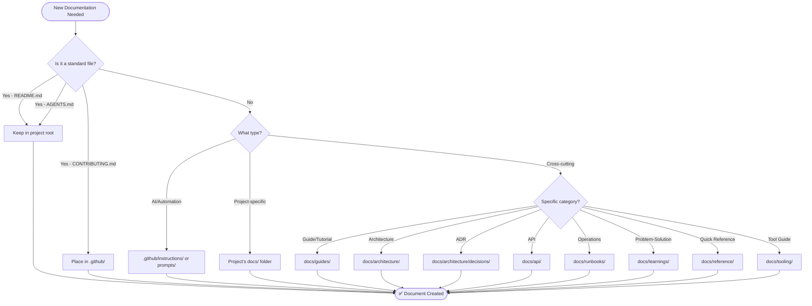

# Documentation Structure Visual Guide

> Visual reference for the optimal documentation directory structure in the Nx monorepo

## Quick Visual Overview

```
📁 my-projects-monorepo/
│
├── 📄 README.md                    # Workspace overview (KEEP IN ROOT)
├── 📄 AGENTS.md                    # AI agent instructions (KEEP IN ROOT)
├── 📄 llms.txt                     # LLM context map (KEEP IN ROOT)
│
├── 📁 .github/                     # GitHub & AI Configuration
│   ├── 📄 CONTRIBUTING.md          # Contribution guidelines (KEEP HERE)
│   ├── 📄 copilot-instructions.md  # Copilot workspace settings
│   ├── 📁 instructions/            # Technology-specific AI guidelines
│   ├── 📁 prompts/                 # Reusable AI prompts
│   └── 📁 chatmodes/               # Copilot chat mode definitions
│
├── 📁 docs/                        # 🎯 CENTRALIZED DOCUMENTATION HUB
│   ├── 📄 README.md                # Documentation index and guide
│   ├── 📄 DOCUMENTATION-STRUCTURE.md # This structure guide
│   │
│   ├── 📁 guides/                  # How-to guides and tutorials
│   │   ├── 📄 README.md
│   │   ├── 📄 getting-started.md
│   │   ├── 📄 development-workflow.md
│   │   └── 📄 deployment.md
│   │
│   ├── 📁 architecture/            # Architecture documentation
│   │   ├── 📄 README.md
│   │   ├── 📄 overview.md          # System architecture overview
│   │   ├── 📁 diagrams/            # Architecture diagrams
│   │   └── 📁 decisions/           # ADRs (Architectural Decision Records)
│   │       └── 📄 adr-NNNN-title.md
│   │
│   ├── 📁 nx-monorepo/             # Nx-specific documentation
│   │   ├── 📄 configuration.md
│   │   ├── 📄 nginx-integration.md
│   │   └── 📄 best-practices.md
│   │
│   ├── 📁 tooling/                 # Tool-specific guides
│   │   ├── 📄 README.md
│   │   ├── 📄 nginx.md
│   │   └── 📄 docker.md
│   │
│   ├── 📁 api/                     # API documentation
│   │   ├── 📄 README.md
│   │   └── 📄 rest-apis.md
│   │
│   ├── 📁 runbooks/                # Operational procedures
│   │   ├── 📄 README.md
│   │   ├── 📄 deployment.md
│   │   └── 📄 troubleshooting.md
│   │
│   ├── 📁 learnings/               # Problem-solution knowledge base
│   │   ├── 📄 README.md
│   │   ├── 📄 nginx.md
│   │   └── 📄 [technology].md
│   │
│   ├── 📁 implementation-plans/    # Implementation plans
│   │   └── 📁 guides/
│   │
│   └── 📁 reference/               # Quick references
│       ├── 📄 README.md
│       ├── 📄 glossary.md
│       └── 📄 commands.md
│
├── 📁 apps/                        # Application projects
│   └── 📁 [app-name]/
│       ├── 📄 README.md            # App overview (KEEP IN APP ROOT)
│       └── 📁 docs/                # Extended app docs (optional)
│           ├── 📄 features.md
│           └── 📄 deployment.md
│
├── 📁 libs/                        # Library projects
│   └── 📁 [lib-name]/
│       ├── 📄 README.md            # Library overview (KEEP IN LIB ROOT)
│       └── 📁 docs/                # API reference (auto-generated)
│
├── 📁 services/                    # Service projects
│   └── 📁 [service-name]/
│       ├── 📄 README.md            # Service overview (KEEP IN SERVICE ROOT)
│       └── 📁 docs/                # Extended service docs
│           ├── 📄 api.md
│           └── 📄 deployment.md
│
└── 📁 tools/                       # Tooling and infrastructure
    └── 📁 [tool-name]/
        ├── 📄 README.md            # Tool overview (KEEP IN TOOL ROOT)
        └── 📁 docs/                # Detailed tool docs
            └── 📄 configuration.md
```

## Documentation Flow Chart



## Decision Matrix

### Where Should My Documentation Go?

| Documentation Type | Location | Keep in Root? | Example |
|-------------------|----------|---------------|---------|
| **Workspace Overview** | `/README.md` | ✅ YES | Main project README |
| **AI Agent Instructions** | `/AGENTS.md` | ✅ YES | High-level AI guidance |
| **Contribution Guidelines** | `/.github/CONTRIBUTING.md` | ✅ YES | How to contribute |
| **App Overview** | `/apps/[app]/README.md` | ✅ YES | App quick start |
| **Library Overview** | `/libs/[lib]/README.md` | ✅ YES | Library API overview |
| **Service Overview** | `/services/[service]/README.md` | ✅ YES | Service quick start |
| **Tool Overview** | `/tools/[tool]/README.md` | ✅ YES | Tool quick start |
| **Architecture Decision** | `/docs/architecture/decisions/` | ❌ NO | ADR for tech choice |
| **How-to Guide** | `/docs/guides/` | ❌ NO | Step-by-step tutorial |
| **System Architecture** | `/docs/architecture/overview.md` | ❌ NO | High-level design |
| **API Documentation** | `/docs/api/` | ❌ NO | API reference |
| **Operational Runbook** | `/docs/runbooks/` | ❌ NO | Deployment procedure |
| **Problem-Solution Log** | `/docs/learnings/` | ❌ NO | Nginx issue resolved |
| **Quick Reference** | `/docs/reference/` | ❌ NO | Command cheatsheet |
| **Tool Configuration** | `/docs/tooling/` | ❌ NO | Cross-cutting tool guide |
| **AI Coding Standards** | `/.github/instructions/` | ❌ NO | TypeScript guidelines |
| **AI Prompts** | `/.github/prompts/` | ❌ NO | Reusable prompts |
| **App-Specific Feature** | `/apps/[app]/docs/` | ❌ NO | Feature documentation |
| **Service Deployment** | `/services/[service]/docs/` | ❌ NO | Service-specific deploy |

## Color-Coded Structure

### 🟢 Keep in Root (Capital Letters)
- README.md
- AGENTS.md
- CONTRIBUTING.md (in .github/)

### 🔵 Centralized in /docs
- Guides
- Architecture
- ADRs
- API docs
- Runbooks
- Learnings
- Reference

### 🟡 Project-Specific
- apps/[name]/docs/
- libs/[name]/docs/
- services/[name]/docs/
- tools/[name]/docs/

### 🟣 AI/Automation
- .github/instructions/
- .github/prompts/
- .github/chatmodes/

## File Naming Quick Reference

### Standard Files (CAPITAL LETTERS)
```
✅ README.md
✅ CONTRIBUTING.md
✅ AGENTS.md
```

### Other Documentation (kebab-case)
```
✅ getting-started.md
✅ development-workflow.md
✅ deployment-guide.md
```

### ADRs (Special Pattern)
```
✅ adr-0001-use-nx-for-monorepo.md
✅ adr-0002-adopt-nestjs.md
```

### Technology Learnings
```
✅ nginx.md
✅ docker.md
✅ playwright.md
```

### AI Files (Special Suffixes)
```
✅ typescript.instructions.md
✅ create-readme.prompt.md
✅ debug.chatmode.md
```

## Common Scenarios

### Scenario 1: Adding a New Feature Guide

**Question**: I want to document how to add authentication.

**Answer**:
- **Location**: `/docs/guides/adding-authentication.md`
- **Why**: Cross-cutting guide for all projects
- **Also Update**: Link from main `/docs/README.md`

### Scenario 2: Documenting an Architectural Decision

**Question**: We decided to use PostgreSQL. Where to document?

**Answer**:
- **Location**: `/docs/architecture/decisions/adr-NNNN-use-postgresql.md`
- **Why**: Major architectural decision
- **Also Update**: Link from `/docs/architecture/README.md`

### Scenario 3: App-Specific Feature Documentation

**Question**: My Next.js app has a unique dashboard feature.

**Answer**:
- **Location**: `/apps/my-programs-app/docs/dashboard-feature.md`
- **Why**: App-specific, not reusable across projects
- **Also Update**: Link from `/apps/my-programs-app/README.md`

### Scenario 4: Troubleshooting a Production Issue

**Question**: NGINX proxy had an issue, I fixed it. Where to document?

**Answer**:
- **Location**: `/docs/learnings/nginx.md`
- **Format**: Problem-solution entry
- **Why**: Shared knowledge for future reference

### Scenario 5: API Endpoint Documentation

**Question**: Email service has a new API endpoint.

**Answer**:
- **Location**: `/docs/api/email-service-api.md` (centralized)
- **Or**: `/services/my-nest-js-email-microservice/docs/api.md` (service-specific)
- **Prefer**: Centralized if used by multiple consumers

### Scenario 6: Deployment Procedure

**Question**: How to document the deployment process?

**Answer**:
- **Location**: `/docs/runbooks/deployment.md`
- **Why**: Operational procedure, not a tutorial
- **Format**: Step-by-step runbook with verification steps

## Migration Guidelines

### ⚠️ DO NOT MOVE FILES NOW

This structure is for **new documentation** and **future reorganization**.

### When You Eventually Migrate:

1. **Plan First**: Identify what to move
2. **Create New Location**: Follow this structure
3. **Add Redirect**: Leave a note in old location
4. **Update Links**: Fix all references
5. **Test**: Verify all links work
6. **Deprecate**: Mark old location as deprecated
7. **Grace Period**: Wait before removing
8. **Remove**: Delete old files after grace period

### Example Migration Note:

```markdown
# ⚠️ Moved

This documentation has moved to: [/docs/architecture/decisions/adr-0001-use-nx.md](../../docs/architecture/decisions/adr-0001-use-nx.md)

This file will be removed on: 2025-11-12
```

## Key Principles

### 1. 🎯 Discoverability First
Documentation should be where people expect to find it.

### 2. 📍 Locality Matters
Keep docs close to what they document when project-specific.

### 3. 🔄 Single Source of Truth
Don't duplicate - reference instead.

### 4. 🏷️ Clear Naming
Use descriptive, consistent naming conventions.

### 5. 🔗 Cross-Reference
Link related documentation together.

## Quick Start Checklist

- [ ] Read this visual guide
- [ ] Review [DOCUMENTATION-STRUCTURE.md](../DOCUMENTATION-STRUCTURE.md)
- [ ] Check [/docs/README.md](../README.md) for the index
- [ ] Follow templates for new docs
- [ ] Update llms.txt for major additions
- [ ] Link from related documentation

## Questions?

- **Structure Questions**: See [DOCUMENTATION-STRUCTURE.md](../DOCUMENTATION-STRUCTURE.md)
- **Contributing**: See [.github/CONTRIBUTING.md](../../.github/CONTRIBUTING.md)
- **Issues**: Open an issue with label `documentation`

---

**Remember**: This structure supports growth. Start simple, evolve as needed, always prioritize discoverability!
