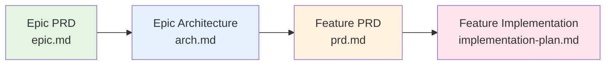

# Documentation Workflow - Quick Reference

This guide provides a quick reference for the documentation creation workflow in this Nx monorepo.

## 🎯 Quick Start

To create documentation, use the `documentation` chatmode and follow the dependency chain.

## 📁 Directory Structure at a Glance

### Monorepo-Level Documentation
```
docs/epics/{epic-name}/
├── epic.md                                    # Epic PRD
├── arch.md                                    # Epic Architecture
└── features/{feature-name}/
    ├── prd.md                                 # Feature PRD
    └── implementation-plan.md                 # Implementation Plan
```

### Project-Specific Documentation
```
docs/{project-type}/{project-name}/
├── epics/{epic-name}/
│   ├── epic.md                                # Epic PRD
│   └── arch.md                                # Epic Architecture
└── features/{feature-name}/
    ├── prd.md                                 # Feature PRD
    └── implementation-plan.md                 # Implementation Plan
```

Where `{project-type}` is: `apps`, `services`, `libs`, or `tools`

### Architectural Decisions
```
docs/architecture/decisions/
└── adr-{NNNN}-{title-slug}.md                 # ADR (sequential numbering)
```

## 🔄 Documentation Dependency Chain



**Rule**: Each document requires all previous documents in the chain to exist first.

## 📝 Document Types

| Document | File Name | Requires | Prompt Template |
|----------|-----------|----------|-----------------|
| **Epic PRD** | `epic.md` | None | `breakdown-epic-pm.prompt.md` |
| **Epic Architecture** | `arch.md` | Epic PRD | `breakdown-epic-arch-restricted.prompt.md` |
| **Feature PRD** | `prd.md` | Epic PRD + Architecture | `breakdown-feature-prd.prompt.md` |
| **Feature Implementation** | `implementation-plan.md` | Feature PRD | `breakdown-feature-implementation.prompt.md` |
| **ADR** | `adr-{NNNN}-{title-slug}.md` | None | `create-architectural-decision-record.prompt.md` |

## 🚀 How to Create Documentation

### Step 1: Choose the Scope

Ask yourself: "Is this monorepo-level or project-specific?"

- **Monorepo-level**: Affects multiple projects → Use `/docs/epics/`
- **Project-specific**: Affects one app/service/lib → Use `/docs/{project-type}/{project-name}/`

### Step 2: Use the Documentation Chatmode

All documentation creation uses the `documentation` chatmode:
```
.github/chatmodes/documentation.chatmode.md
```

### Step 3: Follow the Dependency Chain

The chatmode will:
1. Check for prerequisite documents
2. Create missing dependencies first
3. Guide you through the workflow
4. Place documents in correct directories
5. Suggest next steps

### Step 4: Provide Required Information

Each document type requires specific information (the chatmode will ask):

**Epic PRD:**
- Epic idea/concept
- Target users
- Business goals

**Epic Architecture:**
- Epic PRD reference
- Technical approach
- Technology stack

**Feature PRD:**
- Feature idea
- Parent epic reference
- User stories

**Feature Implementation:**
- Feature PRD reference
- Technical details
- Implementation approach

**ADR:**
- Decision title
- Context
- Decision rationale
- Alternatives considered

## 🎨 Examples

### Example 1: Creating a Monorepo-Level Epic

**Request**: "Create an epic for implementing SSO across all apps"

**AI Response**:
1. Confirms scope: Monorepo-level (affects multiple apps)
2. Path: `/docs/epics/sso-implementation/epic.md`
3. Gathers information for Epic PRD
4. Creates Epic PRD
5. Suggests creating Epic Architecture next

### Example 2: Creating a Service-Specific Feature

**Request**: "Create a feature to send scheduled emails in the email service"

**AI Response**:
1. Confirms scope: Service-specific (email microservice)
2. Checks for parent epic → If missing, creates it first
3. Path: `/docs/services/my-nest-js-email-microservice/features/scheduled-emails/prd.md`
4. Gathers information for Feature PRD
5. Creates Feature PRD
6. Suggests creating Implementation Plan next

### Example 3: Creating an ADR

**Request**: "Document the decision to use Temporal for workflow orchestration"

**AI Response**:
1. Checks existing ADRs for next number
2. Path: `/docs/architecture/decisions/adr-0002-use-temporal-for-workflows.md`
3. Gathers context, decision, alternatives
4. Creates ADR with proper structure

## ✅ Quality Checklist

Before considering documentation complete:

- [ ] All required sections from template are present
- [ ] File is in the correct directory
- [ ] File name follows conventions (kebab-case, proper numbering)
- [ ] Dependencies are linked (parent epic, related docs)
- [ ] Mermaid diagrams are syntactically correct
- [ ] Cross-references are accurate
- [ ] Follows instruction guidelines in `.github/instructions/docs/`

## 🔗 Related Resources

- [AGENTS.md](../AGENTS.md) - Complete documentation workflow and AI behavior requirements
- [Documentation Chatmode](../.github/chatmodes/documentation.chatmode.md) - Orchestration chatmode
- [Prompts](../.github/prompts/) - All documentation prompt templates
- [Instructions](../.github/instructions/docs/) - Document-specific formatting guidelines

## 💡 Pro Tips

1. **Always start with Epic PRD** - It's the foundation for everything else
2. **Let the chatmode guide you** - It knows the dependencies and will ask for prerequisites
3. **Be specific about scope** - Clearly indicate if documentation is monorepo-level or project-specific
4. **Link related documents** - Always reference parent epics, related features, and relevant ADRs
5. **Use descriptive names** - Choose clear, concise names for epics and features (kebab-case)
6. **Review before finalizing** - Check all sections are complete and diagrams render correctly

## 🆘 Troubleshooting

**Problem**: "I want to create a feature but don't have an epic"
- **Solution**: The chatmode will detect this and offer to create the epic first

**Problem**: "I'm not sure if this should be monorepo-level or project-specific"
- **Solution**: Ask: "Does this affect multiple projects?" Yes = monorepo-level, No = project-specific

**Problem**: "The documentation is in the wrong directory"
- **Solution**: The chatmode constructs paths based on scope - verify you specified the correct scope

**Problem**: "I need to create an ADR but don't know the next number"
- **Solution**: The chatmode checks existing ADRs and uses the next sequential number automatically
