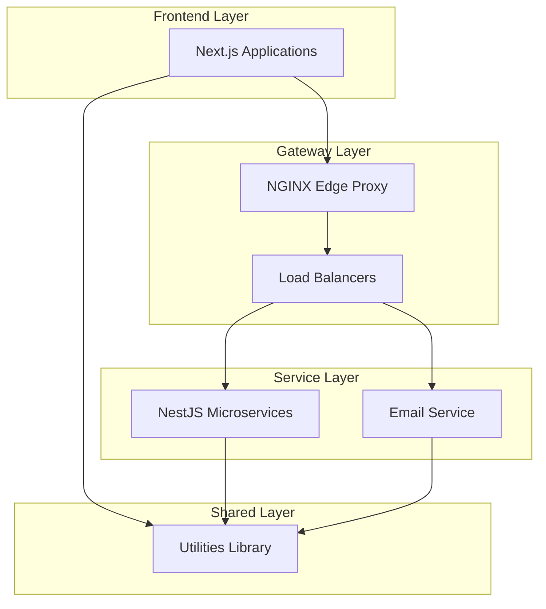
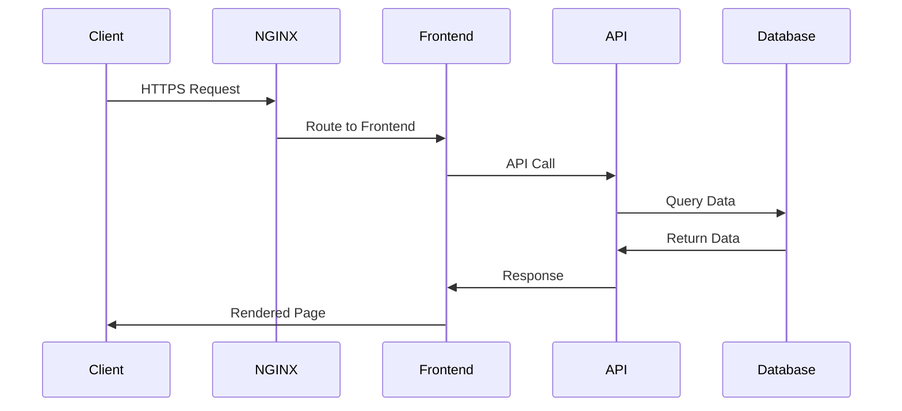

# Architecture Overview

> High-level overview of the system architecture for the Nx monorepo

## System Overview

The Nx monorepo contains a collection of applications, libraries, and services organized in a modular, scalable architecture.

### Key Components

## Architecture Layers

### 1. Frontend Layer

**Location**: `apps/`

- **Next.js Applications**: Server-side rendered React applications
- **Client Apps**: Browser-based user interfaces
- **Static Assets**: Public files and resources

**Key Features**:
- Server-side rendering (SSR)
- Static generation (SSG)
- API routes
- TypeScript support

### 2. Gateway Layer

**Location**: `tools/nginx/`

- **Edge Proxy**: Main entry point for all traffic
- **Load Balancers**: Traffic distribution
  - Frontend LB
  - API LB
  - Email LB

**Key Features**:
- TLS termination
- Request routing
- Load balancing
- Health checks
- Rate limiting

### 3. Service Layer

**Location**: `services/`

- **Microservices**: Independent, deployable services
- **Email Service**: NestJS-based email microservice
- **API Services**: RESTful and GraphQL APIs

**Key Features**:
- Independent deployment
- Service isolation
- API contracts
- Health monitoring

### 4. Shared Layer

**Location**: `libs/`

- **Utilities**: Common functions and types
- **Shared Components**: Reusable UI components
- **Types**: Shared TypeScript types
- **Constants**: Application constants

**Key Features**:
- Code reuse
- Type safety
- Single source of truth
- Dependency management

## Technology Stack

### Frontend Technologies

| Technology | Purpose | Location |
|-----------|---------|----------|
| Next.js | React framework | `apps/my-programs-app/` |
| React | UI library | Applications |
| TypeScript | Type safety | Across codebase |
| Tailwind CSS | Styling | Applications |

### Backend Technologies

| Technology | Purpose | Location |
|-----------|---------|----------|
| NestJS | Node.js framework | `services/` |
| Node.js | JavaScript runtime | Services |
| TypeScript | Type safety | Services |

### Infrastructure

| Technology | Purpose | Location |
|-----------|---------|----------|
| Nx | Monorepo tool | Workspace |
| Docker | Containerization | All projects |
| NGINX | Reverse proxy | `tools/nginx/` |
| Docker Compose | Orchestration | Root |

### Development Tools

| Technology | Purpose |
|-----------|---------|
| Playwright | E2E testing |
| Jest | Unit testing |
| ESLint | Code linting |
| Prettier | Code formatting |
| TypeDoc | Documentation |

## Design Patterns

### Monorepo Architecture

The repository uses Nx for monorepo management with:

- **Workspace Structure**: Apps, libs, services, tools
- **Task Pipeline**: Efficient task execution
- **Dependency Graph**: Automatic dependency tracking
- **Code Generation**: Nx generators for scaffolding
- **Affected Commands**: Build only what changed

### Microservices Pattern

Services follow microservices architecture:

- **Independence**: Each service is independently deployable
- **API Contracts**: Well-defined interfaces
- **Isolation**: Separate databases and state
- **Communication**: HTTP/REST APIs
- **Scalability**: Horizontal scaling capability

### API Gateway Pattern

NGINX acts as the API gateway:

- **Single Entry Point**: All external traffic enters through NGINX
- **Routing**: Routes requests to appropriate services
- **Load Balancing**: Distributes traffic across instances
- **Security**: TLS termination, rate limiting
- **Monitoring**: Health checks and logging

### Repository Pattern

Data access follows repository pattern:

- **Abstraction**: Isolates data access logic
- **Testability**: Easy to mock for testing
- **Consistency**: Standard data access patterns
- **Flexibility**: Easy to swap implementations

## Communication Patterns

### Synchronous Communication

- **HTTP/REST**: Primary communication method
- **Request-Response**: Direct service calls
- **API Gateway**: Centralized routing

### Asynchronous Communication

- **Message Queues**: _(planned)_ Event-driven communication
- **Event Bus**: _(planned)_ Pub/sub pattern
- **Background Jobs**: _(planned)_ Async processing

## Data Architecture

### Data Flow

### Data Storage

- **Application State**: Client-side and server-side state
- **Session Storage**: _(planned)_ User sessions
- **Persistent Storage**: _(planned)_ Database
- **Cache**: _(planned)_ Redis for caching

## Security Architecture

### Security Layers

1. **Network Security**
   - HTTPS/TLS encryption
   - Rate limiting
   - DDoS protection

2. **Application Security**
   - Input validation
   - Authentication
   - Authorization
   - CORS policies

3. **Data Security**
   - Encrypted at rest
   - Encrypted in transit
   - Access controls

### Authentication & Authorization

- **JWT Tokens**: _(planned)_ Token-based auth
- **API Keys**: _(planned)_ Service-to-service auth
- **OAuth**: _(planned)_ Third-party auth
- **RBAC**: _(planned)_ Role-based access control

## Deployment Architecture

### Development

- Local development environment
- Docker Compose for local services
- Hot reload enabled
- Development TLS certificates

### Staging

- Containerized deployment
- Staging environment variables
- Let's Encrypt staging certificates
- Automated testing

### Production

- Containerized deployment
- Production environment variables
- Let's Encrypt production certificates
- Monitoring and logging
- Auto-scaling _(planned)_

## Scalability Strategy

### Horizontal Scaling

- **Stateless Services**: All services are stateless
- **Load Balancing**: NGINX distributes traffic
- **Container Orchestration**: _(planned)_ Kubernetes
- **Auto-Scaling**: _(planned)_ Based on metrics

### Vertical Scaling

- **Resource Limits**: Defined CPU/memory limits
- **Performance Tuning**: Optimized configurations
- **Database Scaling**: _(planned)_ Read replicas

## Monitoring & Observability

### Metrics

- **Health Checks**: Service health endpoints
- **Performance Metrics**: Response times, throughput
- **Resource Metrics**: CPU, memory, disk usage

### Logging

- **Structured Logging**: JSON format logs
- **Log Aggregation**: _(planned)_ Centralized logging
- **Log Levels**: Debug, info, warn, error

### Tracing

- **Request Tracing**: _(planned)_ Distributed tracing
- **Performance Profiling**: _(planned)_ APM tools

## Future Considerations

### Planned Enhancements

- [ ] Database integration (PostgreSQL/MongoDB)
- [ ] Message queue (RabbitMQ/Redis)
- [ ] Kubernetes deployment
- [ ] CI/CD pipelines
- [ ] Monitoring stack (Prometheus/Grafana)
- [ ] Service mesh (Istio)
- [ ] API versioning strategy
- [ ] GraphQL gateway

### Technical Debt

See [Learnings](../learnings/) for documented issues and solutions.

## Related Documentation

- [Architectural Decisions](./decisions/)
- [Architecture Diagrams](./diagrams/)
- [NGINX Integration](../nx-monorepo/nginx-integration.md)
- [API Documentation](../api/)
- [Deployment Runbooks](../runbooks/)

## Maintenance

This document should be updated when:

- New major components are added
- Architecture patterns change
- Technology stack evolves
- Design decisions are made

**Last Updated**: 2025-10-12  
**Version**: 1.0.0
