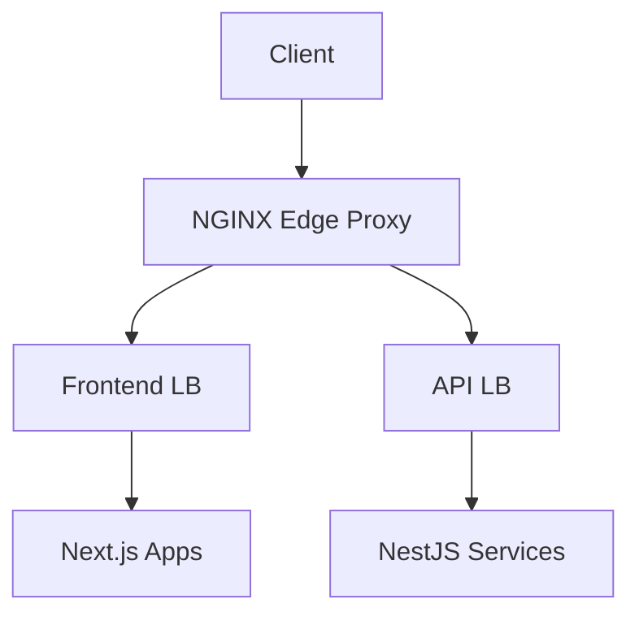

# Architecture Documentation

System architecture documentation, design decisions, and technical diagrams.

## Overview

This directory contains documentation about the system architecture, including high-level overviews, architectural decisions, and visual diagrams.

## Contents

### 📄 [Overview](./overview.md)
High-level architecture overview of the entire system.

- System components
- Service interactions
- Technology stack
- Integration patterns

### 📊 [Diagrams](./diagrams/)
Visual representations of the architecture.

- System diagrams
- Component diagrams
- Sequence diagrams
- Deployment diagrams

### 📋 [Decisions](./decisions/)
Architectural Decision Records (ADRs).

- Design decisions and rationale
- Technology choices
- Pattern selections
- Trade-off analysis

## Architectural Decision Records (ADRs)

ADRs document important architectural decisions made in the project. Each ADR follows this format:

**File naming**: `adr-NNNN-short-title.md`

### Current ADRs

- [ADR-0001: Use Nx for Monorepo Management](./decisions/adr-0001-use-nx-for-monorepo-management.md)

### ADR Template

```markdown
# ADR-NNNN: [Title]

## Status

[Proposed | Accepted | Deprecated | Superseded by ADR-XXXX]

## Context

What is the issue that we're seeing that is motivating this decision or change?

## Decision

What is the change that we're proposing and/or doing?

## Consequences

What becomes easier or more difficult to do because of this change?

### Positive

- Benefit 1
- Benefit 2

### Negative

- Trade-off 1
- Trade-off 2

### Neutral

- Other consideration

## Related

- Links to related ADRs
- Links to implementation PRs
- Links to documentation
```

## Architecture Principles

### Core Principles

1. **Modularity**: Clear separation of concerns
2. **Scalability**: Designed to scale horizontally and vertically
3. **Maintainability**: Easy to understand and modify
4. **Testability**: Comprehensive testing at all levels
5. **Security**: Security by design
6. **Performance**: Optimized for performance

### Design Patterns

- **Microservices**: Independent, deployable services
- **API Gateway**: Centralized entry point with NGINX
- **Event-Driven**: Asynchronous communication where appropriate
- **Repository Pattern**: Data access abstraction
- **Dependency Injection**: Loose coupling

## Technology Stack

### Frontend
- **Next.js**: React framework for applications
- **React**: UI library
- **TypeScript**: Type-safe development

### Backend
- **NestJS**: Node.js framework for microservices
- **TypeScript**: Type-safe development
- **Node.js**: JavaScript runtime

### Infrastructure
- **Nx**: Monorepo management
- **Docker**: Containerization
- **NGINX**: Reverse proxy and load balancing

### Tools
- **Playwright**: E2E testing
- **Jest**: Unit testing
- **ESLint**: Code linting
- **Prettier**: Code formatting

## Creating ADRs

### When to Create an ADR

Create an ADR when making decisions about:

- Architecture patterns
- Technology choices
- Integration approaches
- Security implementations
- Performance trade-offs
- Scalability strategies

### ADR Process

1. **Identify the Decision**: What needs to be decided?
2. **Research Options**: Explore alternatives
3. **Draft ADR**: Create using template
4. **Review**: Get feedback from team
5. **Accept**: Mark as accepted once agreed
6. **Implement**: Follow through with implementation
7. **Reference**: Link from relevant documentation

### ADR Numbering

- Use sequential numbering: `adr-0001`, `adr-0002`, etc.
- Pad with zeros for sorting: `adr-0001` not `adr-1`
- Reserve numbers 0001-0099 for foundational decisions
- Use 0100+ for feature-specific decisions

## Diagrams

### Types of Diagrams

1. **System Architecture**: Overall system structure
2. **Component Diagrams**: Internal component relationships
3. **Sequence Diagrams**: Interaction flows
4. **Deployment Diagrams**: Infrastructure and deployment
5. **Data Flow Diagrams**: Data movement through system

### Diagram Tools

Recommended tools for creating diagrams:

- **Mermaid**: Text-based diagrams in Markdown
- **Draw.io**: Web-based diagramming
- **PlantUML**: Text-based UML diagrams
- **Excalidraw**: Hand-drawn style diagrams

### Mermaid Example



## Maintenance

### Regular Reviews

- **Quarterly**: Review architecture for alignment with goals
- **After Major Changes**: Update diagrams and documentation
- **When ADRs Change**: Update status and cross-references

### Keeping Current

1. Update diagrams when architecture changes
2. Mark deprecated ADRs when superseded
3. Add new ADRs for significant decisions
4. Cross-reference related documentation
5. Keep overview.md current with system state

## Related Documentation

- [Guides](../guides/)
- [API Documentation](../api/)
- [Runbooks](../runbooks/)
- [Documentation Structure](../DOCUMENTATION-STRUCTURE.md)

## Contributing

To contribute to architecture documentation:

1. Follow the ADR template for decisions
2. Use standard diagram formats (Mermaid preferred)
3. Update this README when adding content
4. Cross-reference related documentation
5. Keep diagrams in `/diagrams` directory
