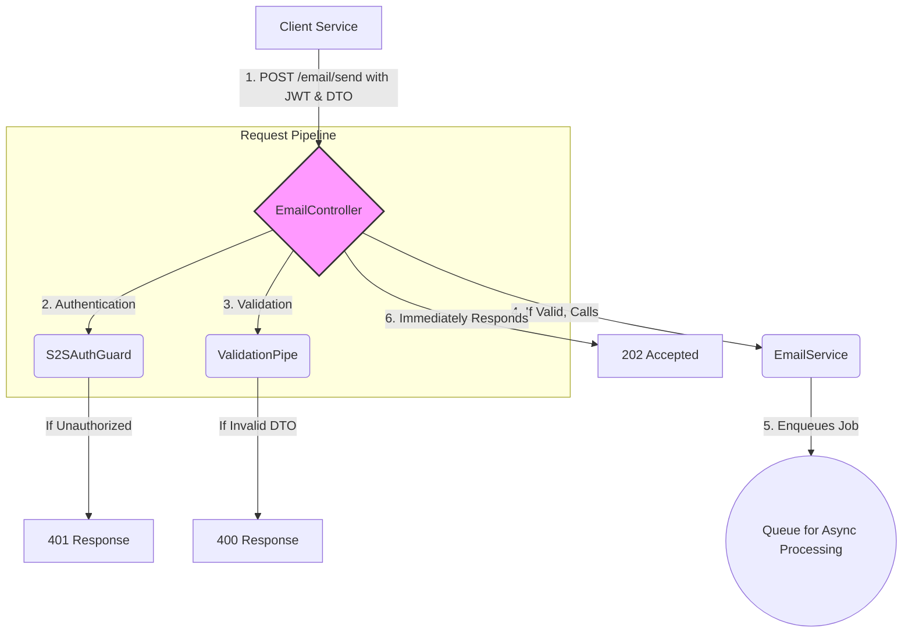

# Implementation Plan: Secure Email API

## Goal

To create a secure, reliable, and well-defined `POST /email/send` API endpoint. This endpoint will be the primary entry point for all internal services to send transactional emails. It will be responsible for request validation, authentication, and handing off the email request to an asynchronous processing mechanism.

## Requirements

- Implement a `POST /email/send` endpoint in a dedicated `EmailController`.
- Protect the endpoint using the `S2SAuthGuard`.
- Validate the incoming request body against a `SendEmailDto`.
- The DTO must require `to` (string), `subject` (string), and `body` (string).
- On valid request, the endpoint should delegate the sending logic to the `EmailService` and immediately return a `202 Accepted` response.
- On invalid request, it should return a `400 Bad Request` with validation errors.

## Technical Considerations

### System Architecture Overview

The `EmailController` and its `/send` endpoint are the primary interface of the `email-service`. The controller acts as the gatekeeper, enforcing security and validation before passing valid requests to the application's core logic.



- **Technology Stack Selection**:
  - **Nest.js Controllers**: Standard for creating RESTful endpoints in Nest.js.
  - **Nest.js Pipes (`ValidationPipe`)**: The best practice for request validation. It uses `class-validator` and `class-transformer` under the hood to automatically validate incoming payloads against DTOs.
  - **Nest.js Guards**: Used for authentication, as implemented in the S2S Authentication enabler.
  - **DTOs (Data Transfer Objects)**: A fundamental pattern for defining the shape of data coming into and out of an application.

- **Integration Points**:
  - **S2S Authentication**: The `S2SAuthGuard` will be applied directly to this endpoint.
  - **Asynchronous Processing**: The controller will integrate with a service (`EmailService`) that is responsible for queuing the email job, ensuring the API responds quickly.
  - **Input Validation**: The `ValidationPipe` will be used globally or on the endpoint to enforce the `SendEmailDto`.

### File Structure

The following files will be created/modified within `apps/email-service/src/`:

```sh
email/
├── email.controller.ts
├── email.service.ts
└── dto/
    └── send-email.dto.ts
```

### Implementation Details

1. **`send-email.dto.ts`**:
   - Create a DTO class `SendEmailDto`.
   - Use `class-validator` decorators to define the validation rules.

   ```typescript
   import { IsEmail, IsNotEmpty, IsString } from 'class-validator';

   export class SendEmailDto {
     @IsEmail()
     to: string;

     @IsString()
     @IsNotEmpty()
     subject: string;

     @IsString()
     @IsNotEmpty()
     body: string;
   }
   ```

2. **`email.controller.ts`**:
   - Create the `EmailController`.
   - Apply the `S2SAuthGuard` at the controller level.
   - Create a `POST /send` method that accepts the `SendEmailDto` as its body.
   - Inject the `EmailService`.
   - The method will call `emailService.send(sendEmailDto)` and return nothing, as Nest.js will handle the `202` status code.

   ```typescript
   import { Body, Controller, Post, UseGuards, HttpCode } from '@nestjs/common';
   import { S2SAuthGuard } from '../auth/s2s-auth.guard';
   import { EmailService } from './email.service';
   import { SendEmailDto } from './dto/send-email.dto';

   @UseGuards(S2SAuthGuard)
   @Controller('email')
   export class EmailController {
     constructor(private readonly emailService: EmailService) {}

     @Post('send')
     @HttpCode(202) // Set the default success status code to 202
     async sendEmail(@Body() sendEmailDto: SendEmailDto) {
       await this.emailService.send(sendEmailDto);
     }
   }
   ```

3. **`main.ts` (Global Validation Pipe)**:
   - To ensure all endpoints use DTO validation, the `ValidationPipe` will be applied globally in the application's entry point.

   ```typescript
   // in main.ts
   import { ValidationPipe } from '@nestjs/common';

   async function bootstrap() {
     const app = await NestFactory.create(AppModule);
     app.useGlobalPipes(new ValidationPipe()); // Enable global validation
     await app.listen(3000);
   }
   bootstrap();
   ```

### Security & Performance

- **Security**:
  - The endpoint is secured by the `S2SAuthGuard`, preventing unauthorized access.
  - The `ValidationPipe` protects against malformed payloads and provides a layer of defense against injection-style attacks by ensuring data conforms to the expected types.
- **Performance**:
  - The endpoint is designed to be highly responsive. By delegating the actual email sending to a background process, the API can acknowledge the request and return a `202 Accepted` status in milliseconds. This prevents the client from being blocked by a potentially slow SMTP transaction.
