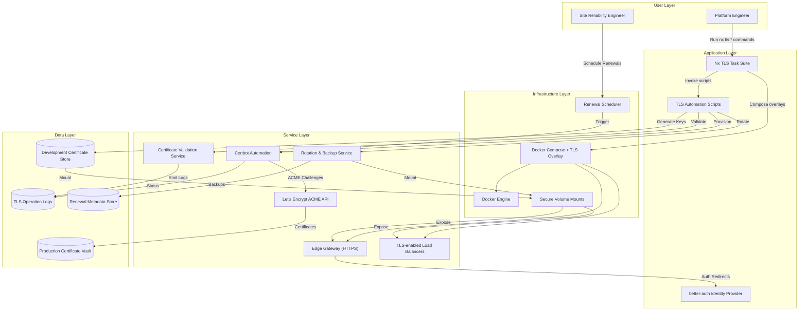

# Epic Architecture Specification — Automated TLS and Certificate Management

## 1. Epic Architecture Overview

The TLS automation epic equips the edge platform with scripts, Nx automation, and hardened NGINX configuration so teams can enable HTTPS in minutes. Certificate generation, validation, rotation, and Let’s Encrypt enrollment run through Docker-aware shell tooling while secrets mount securely into containers. Consistent TLS snippets, Compose overlays, and observability hooks ensure both SaaS and self-hosted operators maintain a modern, compliant security posture without bespoke work.

## 2. System Architecture Diagram

## 3. High-Level Features & Technical Enablers

### Features

- Automated development certificate generation covering localhost SANs with one-step Nx targets.
- Certificate validation pipeline that checks permissions, SAN coverage, expiration horizons, and key alignment.
- Rotation workflow that backs up retiring certificates, performs zero-downtime reloads, and supports configurable toggles.
- Let’s Encrypt setup tooling with OS detection, ACME challenge orchestration, renewal scheduling, and reload hooks.
- TLS Compose overlay and hardened NGINX snippet enforcing strong protocols, cipher suites, OCSP stapling, and HSTS.
- Comprehensive documentation (setup, quick start, runbook) guiding SaaS and self-hosted operators through HTTPS enablement.

### Technical Enablers

- Shell tooling suite (`generate-dev-certs`, `validate-certs`, `rotate-certs`, `setup-letsencrypt`) container-aware and shellcheck compliant.
- Nx task integrations (`tls:generate-dev-certs`, `tls:validate-certs`, `tls:rotate-certs`, `tls:setup-letsencrypt`, `tls:test-https`).
- Docker Compose TLS overlay with secure volume mounts and HTTPS health checks.
- Secrets management pattern storing certificates outside source control and mounting read-only into containers.
- Logging and telemetry hooks capturing TLS lifecycle events for auditability.

## 4. Technology Stack

- **Automation:** Nx monorepo tasks, Bash scripting with shellcheck guidelines, Cron for renewal scheduling.
- **Edge Platform:** NGINX containers configured with TLS snippets, OCSP stapling, HSTS, and modern cipher suites.
- **Certificate Services:** Certbot for ACME interactions, Let’s Encrypt API, local OpenSSL utilities for development certs.
- **Security:** better-auth integration for authentication handshakes, strict permission checks, secure volume mounts.
- **Infrastructure:** Docker Compose overlays, OCI registry for container images, optional secrets vault for production storage.
- **Observability:** Structured logs, renewal metadata, and Nx status outputs for pipelines.

## 5. Technical Value

**High** — Automated TLS removes a major operational risk by guaranteeing timely renewals, secure defaults, and consistent configuration across environments. The tooling reduces onboarding friction and safeguards revenue-critical endpoints from certificate failures.

## 6. T-Shirt Size Estimate

**M (Medium)** — While the automation touches multiple subsystems, the effort leverages existing container infrastructure and documentation patterns, keeping scope concentrated within the edge toolchain.
