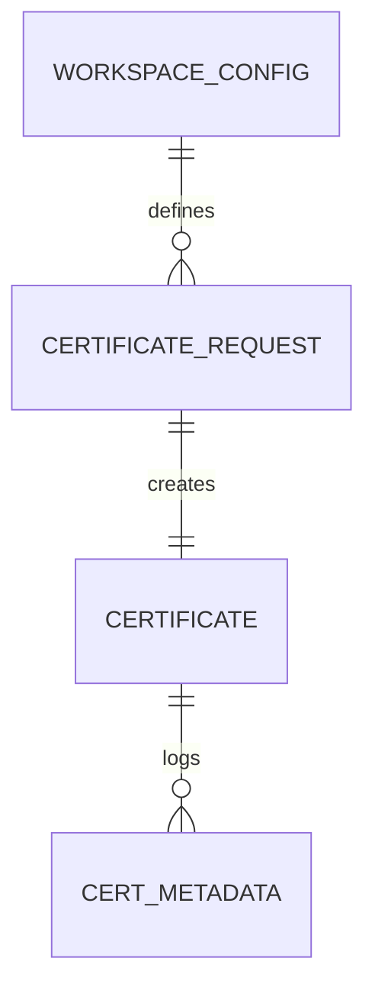
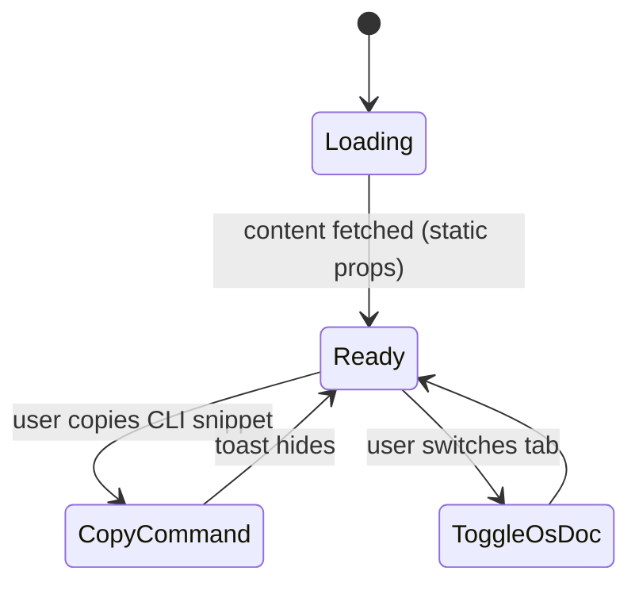

# Feature Implementation Plan — Automated Development Certificate Generation

## Goal

Provide a reliable, reproducible workflow for issuing HTTPS development certificates that cover all local endpoints and enforce strong cryptographic defaults. The plan enables every engineer to bootstrap TLS locally through a single Nx target without diving into OpenSSL minutiae. It also formalizes trust-store guidance across operating systems so browser warnings disappear during dev workflows. Ultimately, the automation must align local security posture with production expectations while remaining fast to execute and simple to maintain.

## Requirements

- Script certificate generation using Bash (with POSIX-compatible fallbacks) and OpenSSL, defaulting to RSA 4096 with a selectable EC P-256 option.
- Support SAN coverage for localhost, 127.0.0.1, ::1, and custom domains supplied via CLI flags or workspace config.
- Expose an Nx target `tls:generate-dev-certs` that forwards options such as validity days, key algorithm, and output directory.
- Emit structured summary output (JSON + human-readable table) including subject, SAN list, fingerprint, validity window, and file paths.
- Apply restrictive file permissions (`chmod 600` keys, `chmod 644` certs) and fail fast if the filesystem denies updates.
- Provide trust-store installation guides for macOS (Keychain), Windows (certmgr), and Linux (update-ca-trust / NSS) plus automation hooks where OS scripting is feasible.
- Integrate shell linting (`shellcheck`) and unit tests (Bats) with an Nx `lint` / `test` target binding.
- Document cleanup commands that revoke or delete generated certs to avoid stale assets in developer machines.

## Technical Considerations

### System Architecture Overview

```mermaid
flowchart LR
  subgraph Frontend Layer
    FE1[Developer CLI / Nx Workspace]
  end
  subgraph API Layer
    API1[Nx Executor Adapter]
  end
  subgraph BusinessLogic Layer
    BL1[Certificate Generation Service]
    BL2[SAN Resolution Module]
    BL3[Trust Store Guidance Generator]
  end
  subgraph Data Layer
    DL1[Workspace Config JSON]
    DL2[Certificate Output (PEM)]
    DL3[Audit Metadata Logs]
  end
  subgraph Infrastructure Layer
    INF1[Local Shell Environment]
    INF2[Dockerized CI Runner]
  end

  FE1 -- "nx run tls:generate-dev-certs" --> API1
  API1 -- "Executor invokes" --> BL1
  BL1 -- "Reads" --> DL1
  BL1 -- "Writes cert/key" --> DL2
  BL1 -- "Logs summary" --> DL3
  BL1 -- "Triggers guidance" --> BL3
  BL3 -- "Publishes OS instructions" --> DL3
  INF2 -- "Validates via CI pipelines" --> API1
```

- **Technology Stack Selection:**
  - Frontend Layer leverages the existing Nx CLI in the monorepo for consistency with other tooling.
  - API Layer uses a custom Nx executor written in TypeScript to bridge workspace defaults and shell scripts.
  - Business logic is split between a TypeScript wrapper coordinating execution and Bash scripts performing crypto tasks.
  - Data layer stores config in JSON/YAML and outputs PEM files plus structured logs for audit trails.
  - Infrastructure relies on local shells (macOS, Windows via WSL, Linux) and CI containers with OpenSSL installed.
- **Integration Points:**
  - Nx executor reads project configuration to supply SAN defaults and output paths.
  - Bash script consumes environment variables for optional overrides (e.g., `DEV_CERT_DAYS=30`).
  - Summary logs feed into the documentation suite for reproducibility.
- **Deployment Architecture:**
  - Package scripts under `tools/nginx/scripts/tls/` and expose via Nx `tools.nginx` project.
  - Distribute via git version control; no external deployment is required but CI must validate with Docker images containing OpenSSL.
- **Scalability Considerations:**
  - Support parallel execution by allowing per-service output directories (namespaced by service) to avoid file contention.
  - Provide caching hints in Nx so repeated runs skip regeneration when certificates remain valid.
  - Future-proof by abstracting SAN resolution to allow team-specific domain injections.

## Database Schema Design

No persistent database entities are introduced. Metadata remains filesystem-based. Documented outputs (JSON summaries) are flat files stored alongside certificates, so relational schema changes are not required. The ER diagram shows the simple artifact relationships for traceability.



- **Table Specifications:** Not applicable; artifacts are files.
- **Indexing Strategy:** Not applicable.
- **Foreign Key Relationships:** Not applicable beyond the conceptual associations shown.
- **Database Migration Strategy:** No database migrations required; track script revisions via semver tags.

## API Design

No HTTP APIs are exposed. The feature operates through Nx CLI and shell scripts.

- **Execution Interface:**

  ```ts
  type GenerateDevCertOptions = {
    outputDir?: string;
    validityDays?: number;
    algorithm?: "rsa" | "ec";
    sanEntries?: string[];
    force?: boolean;
  };
  ```

- **Invocation Pattern:** `npx nx run tools-nginx:generate-dev-certs --validityDays=30 --sanEntries=local.dev,api.local.dev`
- **Authentication/Authorization:** Local execution restricted to developers with repo access; document need to guard scripts with OS permissions.
- **Error Handling:** Exit codes propagate through Nx; executor captures stderr and surfaces actionable messages.
- **Rate Limiting/Caching:** Not applicable; rely on Nx caching to skip repeated work when artifacts exist and `force` not supplied.

## Frontend Architecture

Although no visual UI is required, we will add a developer-focused documentation page within the Next.js app (`my-programs-app`) to surface instructions using CSS Modules and SCSS.

- **Component Hierarchy Documentation:**
  - `pages/docs/dev-certificates.tsx` (route) → wraps `DevCertificatesPage` component.
  - `DevCertificatesPage` combines sections: overview, command reference, troubleshooting.
  - Subcomponents: `CommandSnippet`, `CertificateSummaryTable`, `OsInstructionsTabs`.
  - Each component uses a matching `.module.scss` file per the repo convention.
- **State Flow Diagram:**



- **State Management:** Static data via `getStaticProps`; interactive state (tab selection, copy to clipboard) managed with React hooks.
- **TypeScript Interfaces:**

  ```ts
  interface CertificateInstruction {
    os: "macOS" | "Windows" | "Linux";
    steps: string[];
  }
  ```

## Security & Performance

- **Authentication/Authorization:** Emphasize local execution context; encourage developers to limit script usage to trusted machines.
- **Data Validation:** Validate SAN inputs, ensuring domain strings are sanitized before injecting into OpenSSL config.
- **Secret Handling:** Keys never leave local filesystem; scripts enforce restrictive permissions and warn if Git status detects secrets.
- **Performance Optimization:** Short-circuit regeneration when certificates remain valid; allow concurrency-friendly output directories.
- **Caching Mechanisms:** Use Nx local caching; future enhancement to store metadata in a `.nx/cache` artifact for diff detection.

---

Accessibility has been considered while drafting the documentation component and CLI messaging, but further manual review and tools such as Accessibility Insights are recommended.
