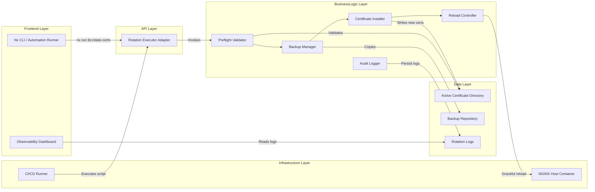
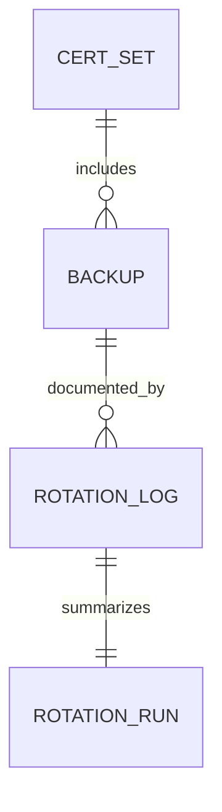
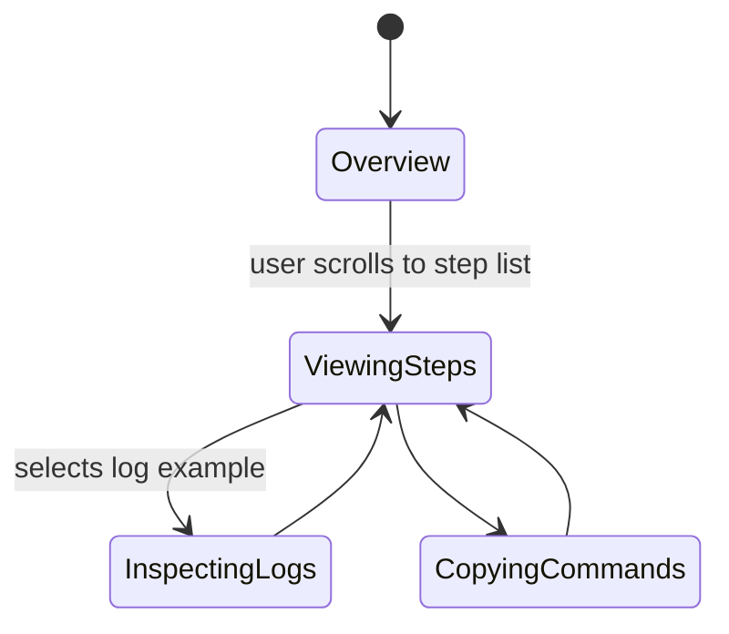

# Feature Implementation Plan — Certificate Rotation Workflow

## Goal

Automate certificate rotation so operations teams can swap TLS assets with a single, reliable process. The workflow must sequentially back up active material, install new certificates, and issue a graceful NGINX reload that preserves open connections. Logging and configuration toggles need to make the process auditable and adaptable to different environments. Overall, the plan aims to minimize human error and downtime during renewals while aligning with compliance retention policies.

## Requirements

- Implement `tools/nginx/scripts/tls/rotate-certs.sh` featuring idempotent steps: preflight checks, backup, install, reload, verify.
- Parameterize the script via CLI flags / environment variables:
  - `--cert-dir`, `--backup-dir`, `--retain-count`, `--dry-run`, `--skip-reload`.
- Extend Nx executor `tls:rotate-certs` with options mapping to script flags and support JSON status output for CI.
- Use timestamped backup directories (`YYYYMMDD-HHMMSS`) and enforce secure permissions inherited from originals.
- Trigger NGINX graceful reload via `nginx -s reload` or `systemctl reload nginx` fallback, verifying success by inspecting exit codes and optional health endpoint checks.
- Capture structured logs (JSON + text) detailing steps, durations, backup paths, reload status, and warnings; persist under `tools/nginx/scripts/tls/logs/`.
- Provide automated cleanup that retains only the configured number of backups and archives logs accordingly.
- Add integration tests using Docker Compose scenario to ensure zero downtime on reload.

## Technical Considerations

### System Architecture Overview



- **Technology Stack Selection:** Nx executor in TypeScript coordinates environment detection; core workflow in Bash for portability; health verifications via curl hitting gateway endpoints.
- **Integration Points:**
  - Optionally trigger post-rotation Nx health check (`nginx-health:check`) to confirm service vitality.
  - Logs feed into documentation suite and potentially central logging via tail/ship scripts.
- **Deployment Architecture:** Script packaged with repository, invoked on hosts or containers. Provide Docker Compose example showing rotation in the local stack.
- **Scalability Considerations:**
  - Ensure script handles multiple certificate bundles within directory; future support for parallel rotation by sequential iteration.
  - Provide locking mechanism (flock file) to prevent concurrent rotations on same host.
  - Document approach for multi-node clusters (staggered runs) though actual orchestration stays out of scope.

## Database Schema Design

No relational schema; represent artifacts conceptually.



Metadata stays file-based. Logs stored as JSON; version format for compatibility.

## API Design

No HTTP endpoints; CLI interface surfaces structured output for automation.

```ts
interface RotationResult {
  runId: string;
  startedAt: string;
  completedAt: string;
  actions: Array<{
    name: "backup" | "install" | "reload" | "verify";
    status: "success" | "warning" | "failed";
    details: string;
    durationMs: number;
  }>;
  backupsRetained: number;
  nextRotationHint?: string;
}
```

- Expose JSON via `--output=json` flag to integrate with observability tasks.
- Error handling: exit code `1` when any action fails; provide remediation guidance string.
- Rate limiting: not applicable; ensure locking to prevent conflicts.

## Frontend Architecture

Enhance documentation portal with `CertRotationGuidePage` summarizing workflow.

- **Component Hierarchy:**
  - `CertRotationGuidePage` (route) → sections for prerequisites, CLI usage, log interpretation.
  - Subcomponents: `RotationStepCard`, `BackupList`, `HealthCheckIntegrationPanel`.
- **Styling:** CSS Modules/SCSS per repo pattern.
- **State Flow Diagram:**



- Manage state via React hooks; highlight active step by intersection observer for accessibility.

## Security & Performance

- **Authentication/Authorization:** Require execution on hosts with appropriate privileges; document need to run as service account with least privilege.
- **Data Validation:** Confirm new certificate files exist and match expected naming; verify permissions before swap.
- **Performance:** Pipeline designed to finish under 30 seconds, using atomic moves to avoid partial installs.
- **Caching:** None; but Nx caching may skip dry-run logs when unchanged.
- **Compliance:** Structured logs persisted with timestamps; optionally ship to centralized storage for auditors.

---

Accessibility has been factored into the planned documentation UI and logging outputs, but manual verification with tools like Accessibility Insights remains necessary.
