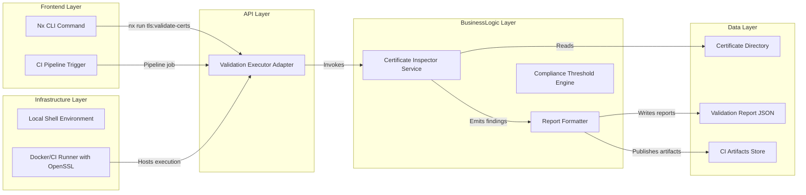
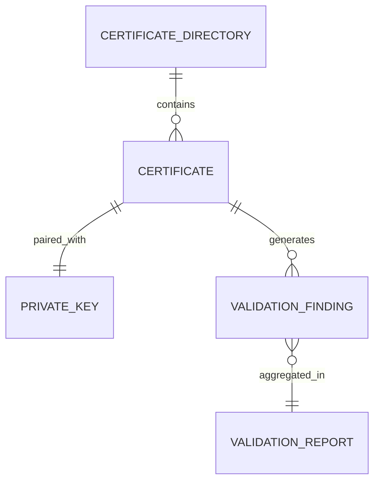
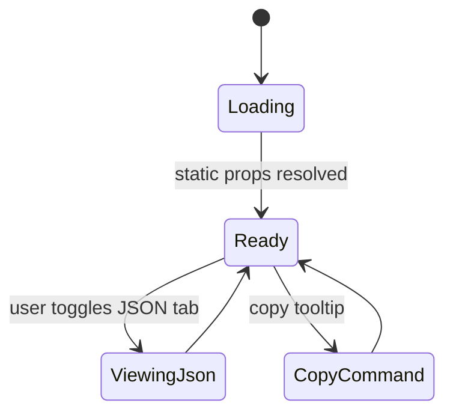

# Feature Implementation Plan — Certificate Validation Pipeline

## Goal

Introduce an automated guardrail that inspects TLS assets before they reach production or developer runtimes. The validation pipeline must detect mismatched key pairs, poor file hygiene, weak cipher choices, and impending expirations. By surfacing issues locally and in CI, the organization reduces outage risk and meets audit obligations. The plan focuses on delivering actionable outputs with minimal execution time across developer laptops and containerized runners.

## Requirements

- Build a portable validation script (`tools/nginx/scripts/tls/validate-certs.sh`) leveraging OpenSSL and POSIX utilities.
- Add Nx executor `tls:validate-certs` supporting flags:
  - `--path` (directory glob), `--warn-days` (default 30), `--output` (`table|json|both`).
- Validate inputs:
  - Confirm certificate/private key pairing using modulus comparison.
  - Evaluate SAN entries, key usage, and signature algorithms.
  - Enforce file permission standards (600 keys, 644 certs) and ownership attributes.
  - Check expiration vs warning threshold and fail if expired.
- Emit machine-readable JSON reports (schema versioned) alongside human-readable tables.
- Integrate with CI by storing artifacts in `tools/nginx/scripts/tls/reports/` and updating pipeline docs.
- Provide Bats-based unit tests and snapshot tests for report formatting.
- Document remediation guidance appended to failed checks.

## Technical Considerations

### System Architecture Overview



- **Technology Stack Selection:** TypeScript executor orchestrating Bash script ensures consistent invocation across OSes. OpenSSL handles cryptographic checks; `jq` used conditionally for JSON formatting (fallback to Node script if unavailable).
- **Integration Points:** Pipeline integrates with GitHub Actions (or Nx Cloud) to capture JSON report artifact; documentation suite references outputs as evidence.
- **Deployment Architecture:** Script resides within repo; Nx task packaged via `tools-nginx` project. CI Docker image must include OpenSSL and coreutils.
- **Scalability Considerations:** Support batch validation with directory globbing; future extension to parallelize using subshells with `xargs -P` when directories large. Cache results when files untouched by leveraging Nx hashing.

## Database Schema Design

No database persistence; treat reports as files. Conceptual ER diagram documents relationships for future pipeline enhancements.



No SQL schema or migrations required; version JSON report schema in documentation.

## API Design

Feature exposes a CLI API only. Define TypeScript types for JSON report consumers.

```ts
interface ValidationFinding {
  certificatePath: string;
  severity: "info" | "warning" | "error";
  code: "KEY_MISMATCH" | "PERMISSIONS" | "EXPIRING" | "SAN_MISSING" | string;
  message: string;
  remediation: string;
}

interface ValidationReport {
  schemaVersion: "1.0";
  generatedAt: string;
  warningsThresholdDays: number;
  findings: ValidationFinding[];
}
```

- **Authentication:** Local developer or CI runner permissions only; ensure CI secrets limit repo access.
- **Error Handling:** Non-zero exit for severity `error`; `warning` statuses return 0 but highlight issues. Wrap script errors to provide actionable guidance.
- **Rate Limiting/Caching:** Not applicable beyond Nx caching.

## Frontend Architecture

Add a documentation page summarizing usage and displaying report examples.

- **Component Hierarchy:**
  - `DevTlsValidationPage` (route) → sections for CLI usage, sample JSON, troubleshooting.
  - Child components: `CommandReference`, `ReportSampleCard`, `WarningTable`.
- **Styling:** Each component uses `.module.scss` following CSS Modules example.
- **State Flow Diagram:**



- **State Management:** use `useState` for tab selection, `useCopyToClipboard` hook for command copying.

## Security & Performance

- **Authentication/Authorization:** Encourage CI contexts to run validation before deploying secrets; restrict script execution via repo permissions.
- **Data Validation:** Sanitize directory inputs; avoid command injection by validating path strings and using `find` with safe flags.
- **Performance:** Process certificates sequentially but allow future parallelization. Short-circuit when encountering fatal errors to save time.
- **Caching:** Nx incremental caching keyed on directory contents; skip revalidation when unchanged.
- **Compliance:** Store JSON reports in artifact directories with timestamps for auditor consumption.

---

Accessibility considerations were incorporated when planning documentation UI, but follow-up manual reviews and tools such as Accessibility Insights are recommended.
