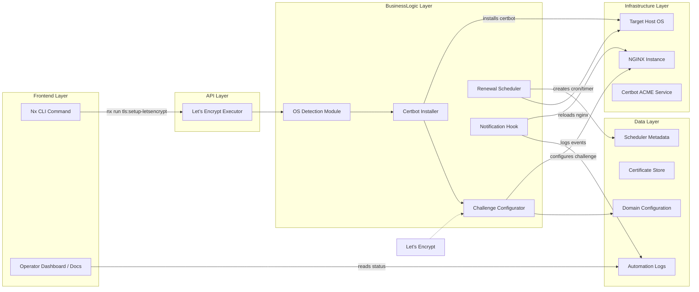
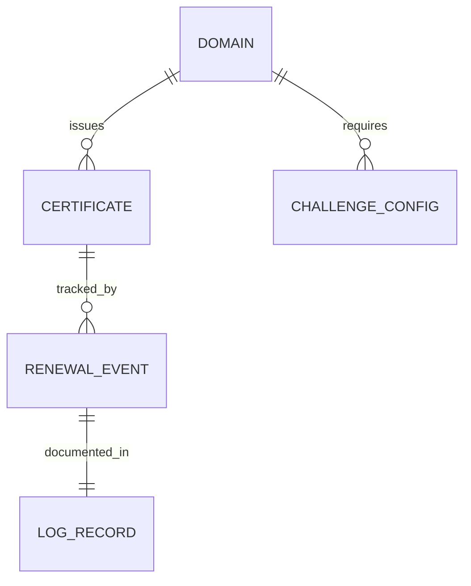
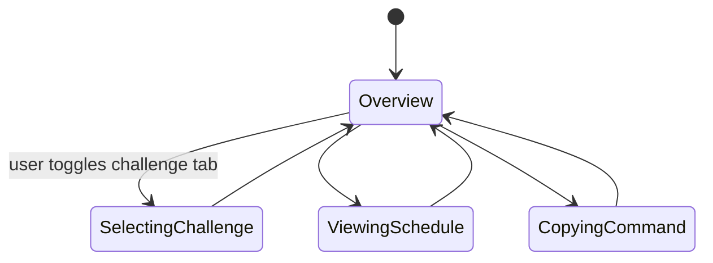

# Feature Implementation Plan — Let’s Encrypt Automation

## Goal

Automate Let’s Encrypt provisioning and renewals across supported environments so production services always present trusted certificates. The implementation abstracts OS-specific setup, challenge configuration, and scheduling details behind Nx commands. By providing hooks, logging, and documentation, teams can confidently onboard domains and maintain renewals without manual intervention while satisfying compliance requirements.

## Requirements

- Create `tools/nginx/scripts/tls/setup-letsencrypt.sh` to install certbot and plugins across Ubuntu/Debian, AlmaLinux/RHEL, and macOS (Homebrew fallback).
- Implement challenge configuration helpers:
  - HTTP-01: generate NGINX snippet to route `/.well-known/acme-challenge` to certbot directory.
  - DNS-01: support manual/plug-in flow with placeholder hook script.
- Develop Nx target `tls:setup-letsencrypt` that:
  - Accepts `--domain`, `--email`, `--challenge=http|dns`, `--staging`, `--renew-hook` flags.
  - Chains installation, enrollment, and schedule creation.
- Set up renewal scheduling: cron (Linux) or systemd timer; on macOS use `launchd` plist templates.
- Provide post-renewal hook script invoking `nginx -s reload`, emitting notifications (log + optional email/webhook stub).
- Store issued certs under `tools/nginx/secrets/tls/` with secure permissions; expose path via Nx config for other scripts.
- Log actions to `/var/log/letsencrypt-automation.log` (or repo-level logs for dev) and capture output for auditors.
- Add documentation updates and sample `.env` entries for configuration.

## Technical Considerations

### System Architecture Overview



- **Technology Stack Selection:** Bash for portability, with helper modules in Python if needed (dns challenge). Nx executor coordinates flow via TypeScript.
- **Integration Points:** Renewal hook triggers certificate validation pipeline (`tls:validate-certs`) post-renewal. Logs exported to documentation suite and optional webhook endpoint for alerting.
- **Deployment Architecture:** Scripts packaged in repo, executed by privileged operators or automation servers. Provide container example with certbot installed.
- **Scalability Considerations:** Support multiple domains via configuration array; schedule jobs using per-domain renewal config. Document safe concurrency for multi-domain hosts.

## Database Schema Design

No database introduced. Conceptual relationships captured below.



Assets remain on filesystem (`/etc/letsencrypt` or repo secrets directory) with metadata stored in logs.

## API Design

Primary interface is CLI via Nx, but define configuration interface for future integrations.

```ts
interface LetsEncryptConfig {
  domain: string;
  email: string;
  challenge: "http" | "dns";
  staging?: boolean;
  postRenewHook?: string;
  dnsProvider?: "manual" | "route53" | "cloudflare";
}
```

- Errors bubble as non-zero exit codes; script prints remediation instructions (e.g., DNS TXT record values for DNS-01).
- Authentication handled by OS privileges; ensure environment variables for DNS providers secure (future extension).
- Rate limiting: use `--staging` flag for dry runs to avoid hitting CA production limits.

## Frontend Architecture

Document automation within Next.js docs portal.

- **Component Hierarchy:**
  - `LetsEncryptAutomationPage`
    - `EnvironmentPrerequisites` component
    - `ChallengeSelector` (tabs for HTTP vs DNS)
    - `RenewalScheduleTimeline`
    - `TroubleshootingAccordion`
- **Styling:** CSS Modules SCSS per guidelines.
- **State Flow Diagram:**



- Manage state using React hooks; data pre-fetched via static props referencing Markdown content.

## Security & Performance

- **Authentication/Authorization:** Scripts require root/sudo; document secure usage and recommend dedicated service accounts.
  - Encourage storing sensitive DNS credentials in environment-specific secret stores.
- **Data Validation:** Validate domain format and email before enrollment. Ensure scripts handle missing dependencies gracefully.
- **Performance:** Installations kept idempotent; re-running script should detect existing certbot and skip reinstall to save time.
- **Caching:** Nx caching not critical but tasks should detect prior success (presence of certs) to skip heavy operations unless `--force` provided.
- **Compliance:** Logs include ACME transaction IDs and renewal times; suggest exporting to centralized log aggregation for audit trails.

---

Accessibility considerations are incorporated in documentation plans, but run manual checks (e.g., Accessibility Insights) to confirm compliance.
