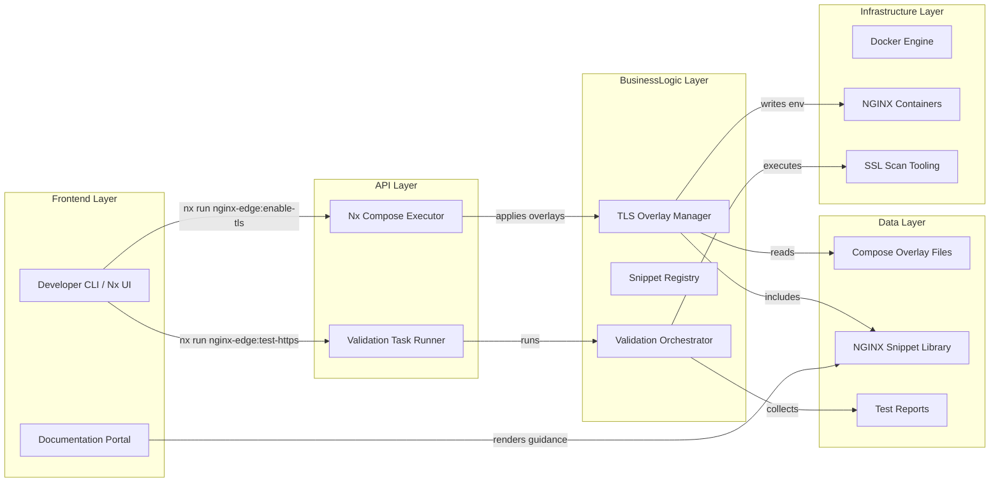
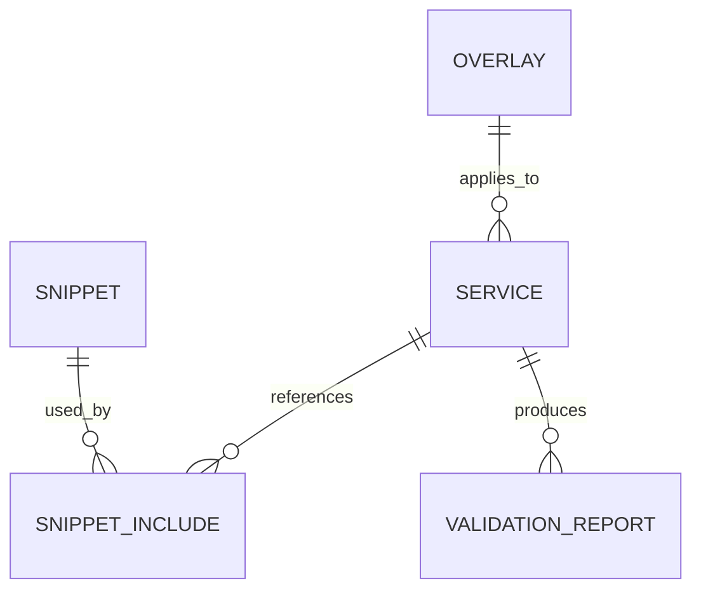
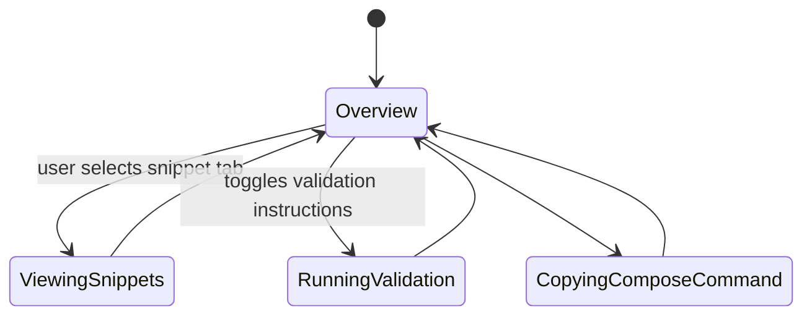

# Feature Implementation Plan — TLS Compose Overlay and Hardened Snippets

## Goal

Establish a reusable TLS baseline for all NGINX edge components via Docker Compose overlays and curated configuration snippets. The implementation guarantees modern cipher suites, secure headers, and controlled certificate mounts without service-specific customization. By codifying best practices, teams gain consistent HTTPS behavior with minimal effort while meeting compliance benchmarks such as SSL Labs "A" ratings.

## Requirements

- Build reusable snippets in `tools/nginx/common/snippets/`:
  - `tls.conf` for protocols/ciphers/OCSP stapling.
  - `headers.conf` for security headers (HSTS, CSP placeholder, X-Frame-Options, etc.).
  - `logging.conf` for structured access/error logging.
- Create Docker Compose overlay files (`docker-compose.tls.yaml`) per edge component (proxy-edge, load balancers) that:
  - Mount certificate directories read-only with correct UID/GID.
  - Bind HTTPS port (443) and optionally redirect HTTP to HTTPS.
  - Inject environment variables for stapling cache path, DH params, etc.
- Implement Nx targets `nginx-edge:enable-tls` (compose up with overlay) and `nginx-edge:test-https` (runs `nginx -t`, curl probes, SSL scan stub).
- Provide automation for `sslscan` or `testssl.sh` invocation against local containers to confirm cipher posture.
- Document override mechanisms for teams needing custom headers or ciphers while retaining safe defaults.
- Add CI checks verifying overlay application via `docker compose -f base -f overlay config` and `nginx -t` within container.
- Update README/RUNBOOK to reflect new overlay usage and troubleshooting flows.

## Technical Considerations

### System Architecture Overview



- **Technology Stack Selection:** Compose overlays maintained as YAML. Validation orchestrator written in TypeScript invoking Docker CLI and `testssl.sh`. Snippets validated with `nginx -t` using containerized command.
- **Integration Points:** Compose overlay expects certificate files generated by dev or production automation; integrate with rotation workflow to keep mounts synchronized. Validation outputs consumed by documentation suite and health monitoring tasks.
- **Deployment Architecture:** Overlays stored alongside base Compose files; Nx target composes file list (`docker compose -f docker-compose.yaml -f docker-compose.tls.yaml up`). Provide sample `.env` ensuring volume paths resolvable.
- **Scalability Considerations:** Support additional services by referencing same snippets; maintain snippet registry mapping to ensure updates propagate. Provide script to diff snippet versions to catch drift.

## Database Schema Design

No database changes; the ER diagram captures configuration relationships.



## API Design

No HTTP API; define CLI configuration objects for automation.

```ts
interface EnableTlsOptions {
  service: "proxy-edge" | "lb-frontend" | "lb-api" | "lb-email";
  autoStart?: boolean;
  validate?: boolean;
  customEnvFile?: string;
}
```

- Nx executor translates options into Compose commands. Provide JSON output summarizing applied snippets and environment requirements.
- Error handling: executor surfaces `nginx -t` or Docker exit codes with remediation hints.

## Frontend Architecture

Extend docs with `TlsOverlayGuidePage` demonstrating overlay usage.

- **Component Hierarchy:**
  - `TlsOverlayGuidePage`
    - `OverlayActivationSteps`
    - `SnippetReferenceTable`
    - `ValidationReportViewer`
    - `TroubleshootingAccordion`
- **Styling:** CSS Modules SCSS per pattern.
- **State Flow Diagram:**



- Use React state for active tabs and command copy to clipboard.

## Security & Performance

- **Authentication/Authorization:** Document requirement for restricted certificate volume permissions and discourage storing private keys in git.
- **Data Validation:** Compose overlay script validates volume paths exist and ensures ownership before starting containers.
- **Performance:** Compose overlay should not significantly increase startup times; ensure `testssl.sh` execution optional due to heavier runtime.
- **Caching:** None required; rely on Docker layer caching for container images.
- **Compliance:** Provide default headers aligning with OWASP recommendations; include checklists for SSL Labs configuration.

---

Accessibility awareness guided documentation planning; conduct manual testing with tools such as Accessibility Insights to validate final UI.
