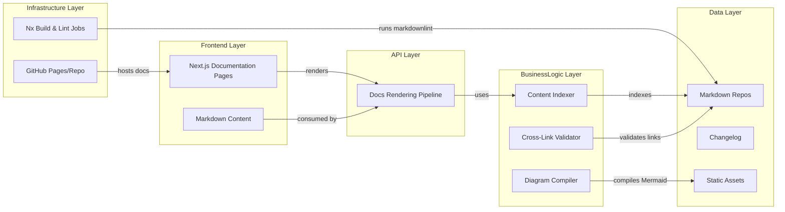
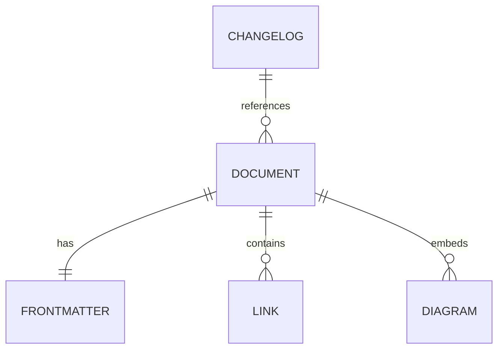
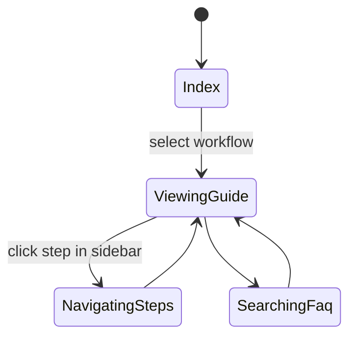

# Feature Implementation Plan — TLS Documentation Suite

## Goal

Deliver a cohesive documentation library that explains every TLS workflow end-to-end, enabling engineers to self-serve certificate tasks with confidence. The suite must cover quickstarts, runbooks, troubleshooting, compliance checklists, and diagrams that map to the automated scripts. By centralizing these resources, teams onboard faster, operate consistently, and satisfy audits with minimal rework.

## Requirements

- Structure documentation under `tools/nginx/docs/tls/` with subdirectories for `quickstart`, `runbook`, `troubleshooting`, `compliance`, and `diagrams`.
- Author guides for each workflow: development cert generation, validation pipeline, rotation workflow, Let’s Encrypt automation, overlay activation.
- Include cross-links to relevant Nx commands and scripts with command snippets.
- Produce diagrams via Mermaid (architecture flows) and ensure they compile (`npm run docs:validate` or similar).
- Maintain a changelog (`CHANGELOG.md`) capturing updates and review sign-offs.
- Implement doc linting via markdownlint and custom checks for required sections.
- Coordinate with SMEs to validate content before publishing (peer review checklist).

## Technical Considerations

### System Architecture Overview



- **Technology Stack Selection:** Markdown source managed in repo, rendered through Next.js static pages. Use Remark/MDX plugins to support code blocks and diagrams.
- **Integration Points:** Link to automation outputs stored in scripts directories; embed summary tables referencing Nx targets.
- **Deployment Architecture:** Docs built as part of Nx site build; ensure `npx nx build my-programs-app` includes new routes. Provide search indexing integration (Algolia docsearch or custom) if available.
- **Scalability Considerations:** Create template generator script for future guides; standardize frontmatter metadata to support indexing.

## Database Schema Design

No traditional database, but define metadata structure.



Metadata captured in Markdown frontmatter (title, workflow, last-reviewed, owner).

## API Design

Documentation served statically; design frontmatter schema for consistency.

```yaml
---
title: "TLS Rotation Runbook"
workflow: "rotate-certificates"
lastReviewed: "2025-10-01"
owners:
  - platform-team
---
```

Implement lint rule verifying presence of these fields.

## Frontend Architecture

Create a documentation index page and detailed guides within Next.js.

- **Component Hierarchy:**
  - `TlsDocsIndexPage`
    - `WorkflowCardGrid`
  - `TlsGuideLayout`
    - `GuideHeader`
    - `StepNavigation`
    - `CommandBlock`
    - `FaqSection`
- **Styling:** CSS Modules/SCSS.
- **State Flow Diagram:**



Implement sticky table of contents for accessibility; ensure keyboard navigation works.

## Security & Performance

- **Authentication:** Docs available internally; ensure repo access controls remain enforced.
- **Data Validation:** Pre-commit hook ensures required sections exist; broken-link checker runs in CI.
- **Performance:** Generate static pages; cache Mermaid diagrams; avoid large image assets.
- **Compliance:** Include checklist capturing audit evidence (log locations, command outputs). Document review cadence to keep content fresh.

---

Documentation and UI plans were created with accessibility in mind; nonetheless, perform manual verification using tools like Accessibility Insights to confirm compliance.
