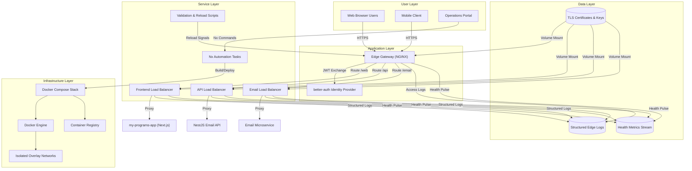

# Epic Architecture Specification — NGINX Edge Traffic Platform

## 1. Epic Architecture Overview

The edge traffic platform introduces a containerized NGINX gateway backed by dedicated load balancers that sit between public clients and the monorepo’s applications. Docker Compose orchestrates an edge proxy that centralizes TLS termination, host-based routing, caching, and security controls, while Nx tasks automate builds, validation, and lifecycle operations. Frontend, API, and email workloads each receive a purpose-built load balancer with shared configuration snippets for logging and security, ensuring the platform scales consistently across SaaS and self-hosted deployments.

## 2. System Architecture Diagram

## 3. High-Level Features & Technical Enablers

### Features

- Centralized edge gateway with host-based routing, TLS termination, caching, and security headers.
- Dedicated load balancers for frontend, API, and email services, each tuned for workload-specific behavior.
- Automated Nx task suite for building Docker images, validating configuration, health checking, and lifecycle operations.
- Shared configuration snippets (headers, logging, base) and environment overlays for development and production parity.
- Operational documentation including README, runbook, quick start, and validation guides for self-hosted and SaaS deployments.

### Technical Enablers

- Docker Compose orchestration with isolated networks and resource limits.
- Registry-published container images for edge proxy and load balancers.
- Nx project targets powering build, release, validation, and monitoring automation.
- Structured logging pipeline and health metrics stream for observability integrations.
- Secrets management pattern for TLS assets mounted into edge containers.

## 4. Technology Stack

- **Edge & Load Balancers:** NGINX running in Docker containers.
- **Application Frameworks:** Next.js (App Router, TypeScript) and NestJS services protected through the edge.
- **Automation:** Nx monorepo task runner, Docker Compose, shell scripts for validation and reloads.
- **Security:** better-auth for identity flows, strict TLS configuration, security header snippets, rate limiting.
- **Observability:** Structured JSON/text logs, health probe scripts, and Nx-driven monitoring commands.
- **Container Registry:** OCI-compliant registry for edge and load balancer images.

## 5. Technical Value

**High** — The platform standardizes ingress for all workloads, reduces duplicated configuration, and enforces security best practices at the boundary. Automated workflows and shared assets accelerate onboarding and maintenance while lowering operational risk.

## 6. T-Shirt Size Estimate

**L (Large)** — Multiple containers, networking layers, automation scripts, and extensive documentation demand significant coordinated effort across platform, security, and application teams.
