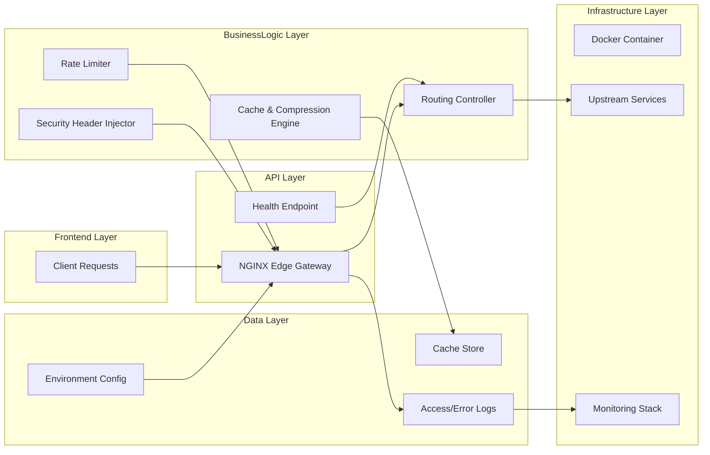
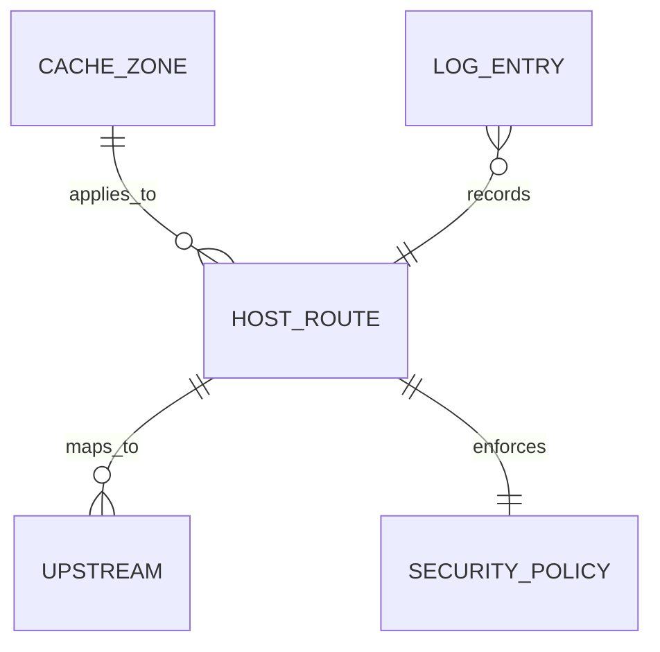
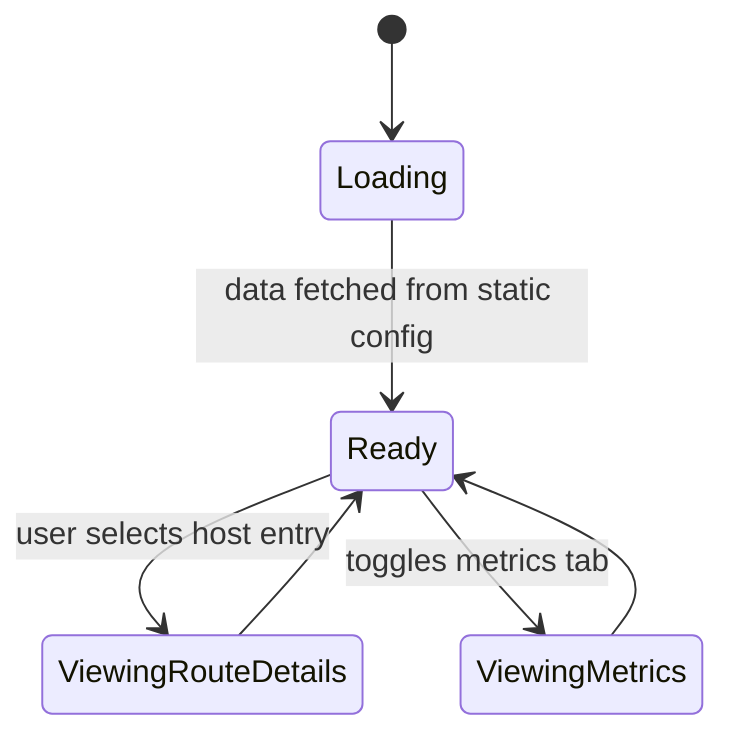

# Feature Implementation Plan — Centralized Edge Gateway

## Goal

Build a production-grade NGINX edge gateway that centralizes TLS termination, host-based routing, caching, compression, and security header policies. The gateway should be packaged as a reusable Docker image with configuration driven by environment variables and overlays. The implementation enables rapid onboarding of new services while maintaining consistent security posture and observability.

## Requirements

- Maintain gateway configuration under `tools/nginx/proxy-edge/` with modular includes for routing, caching, compression, and headers.
- Parameterize upstream routing via template variables (envsubst or lua) sourced from environment variables or mounted config files.
- Package Docker image using non-root user, minimal base (Alpine), and mount points for certificates and shared snippets.
- Implement caching rules with `proxy_cache_path`, `proxy_cache_lock`, gzip/brotli compression toggles, and rate limiting (leaky bucket).
- Expose health endpoints `/health/live` and `/health/ready` that forward to upstream checks and respond quickly.
- Integrate structured logging using JSON format, including request IDs and upstream metrics (proxy status, cache status).
- Provide Nx targets: `edge-gateway:build`, `edge-gateway:serve`, `edge-gateway:test` (includes `nginx -t`, curl smoke tests, Locust mini load test for caching latency).
- Document onboarding flow for new services, showing how to add host entries and overrides via overlay files.

## Technical Considerations

### System Architecture Overview



- **Technology Stack Selection:** NGINX (mainline) with modules for brotli, geoip optional. Docker base image from official `nginx:alpine` with custom entrypoint to render templates.
- **Integration Points:** Logging shipped to existing ELK/Grafana stack via sidecar or Fluent Bit; metrics exposed via `ngx_http_stub_status` or Prometheus exporter. Health endpoints integrated with unified monitoring epic.
- **Deployment Architecture:** Provide Compose overlay for local dev and systemd unit file for production hosts. Environment variables defined in `.env.edge` or secret store.
- **Scalability Considerations:** Support horizontal scaling by keeping gateway stateless (shared config via git/CI). Rate limiting uses shared-memory zones; document deployment guidelines for multi-instance (consistent hashing or Redis-based rate limit future).

## Database Schema Design

No SQL database; capture conceptual mapping between configuration and services.



## API Design

Gateway does not expose new REST endpoints beyond proxying, but define configuration interface for dynamic updates.

```yaml
routes:
  - host: "frontend.example.com"
    upstream: http://lb-frontend:8080
    cache: static-assets
    headersPolicy: hardened
  - host: "api.example.com"
    upstream: http://lb-api:8080
    rateLimit:
      zone: api-requests
      burst: 50
      nodelay: true
```

These values can be rendered into NGINX conf via Jinja2/templating script executed at container start.

## Frontend Architecture

Add a status dashboard page to documentation site summarizing gateway behavior for developers.

- **Component Hierarchy:**
  - `EdgeGatewayOverviewPage`
    - `RoutingTable` component (displays configured hosts)
    - `SecurityPolicySummary`
    - `CacheBehaviorCard`
    - `HealthStatusPanel`
- **Styling:** CSS Modules SCSS.
- **State Flow Diagram:**



Data sourced from static JSON generated during build (exported from config).

## Security & Performance

- **Authentication/Authorization:** Ensure container runs as non-root, drop capabilities, and restrict certificate mounts to read-only.
- **Data Validation:** Template renderer validates hostnames and upstream URLs before writing config; fail fast on invalid inputs.
- **Performance:** Optimize caching directives, enable keepalive to upstreams, and use `worker_processes auto`. Include load-test script verifying <50ms overhead for cached assets.
- **Caching:** Multi-tier caching via NGINX proxy cache; document TTL defaults and purge strategy (CLI tool to purge per host).
- **Compliance:** Default headers include HSTS, CSP base, X-Frame-Options, Referrer-Policy; maintain OCSP stapling optional config.

---

Documentation and dashboards will be created with accessibility awareness, but manual validation using Accessibility Insights is advised.
