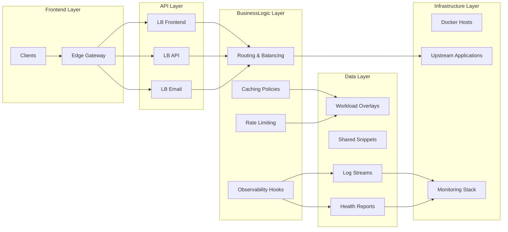
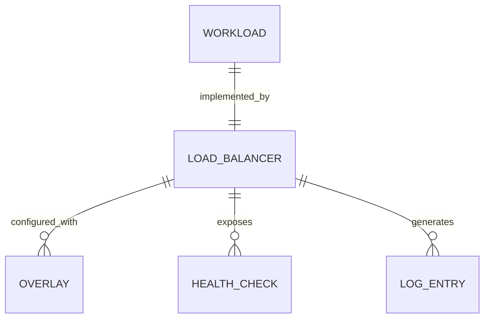
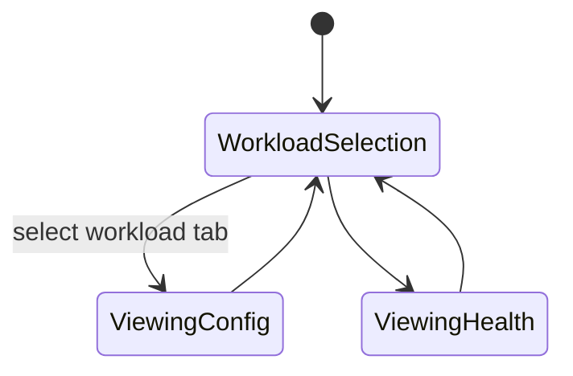

# Feature Implementation Plan — Dedicated Load Balancers

## Goal

Deliver separate NGINX load balancers for frontend, API, and email workloads, each packaged as an independent container with tuned configuration, overlays, and observability. This separation allows teams to scale and adjust policies per workload while retaining shared tooling for deployment and monitoring. The implementation must ensure reliable health checks, consistent logging, and secure operation.

## Requirements

- Maintain per-workload directories under `tools/nginx/load-balancers/{lb-frontend,lb-api,lb-email}/` containing Dockerfile, base config, and overlays.
- Standardize configuration structure: `nginx.conf` loads shared snippets (headers, logging) and workload-specific includes for upstreams, caching, rate limits.
- Provide overlays (`overlays/development.conf`, `overlays/production.conf`) that adjust upstream endpoints, caching TTLs, rate limiting thresholds, and feature flags.
- Implement Nx targets:
  - `lb-frontend:build|serve|test`
  - `lb-api:build|serve|test`
  - `lb-email:build|serve|test`
  Each `test` runs `nginx -t`, cURL health checks, and optional load test snippet.
- Configure health endpoints `/health` and `/metrics` proxied through edge gateway; integrate with unified health monitoring scripts.
- Ensure structured logs include `workload` label for downstream ingestion.
- Document onboarding steps for services to register with appropriate load balancer overlays.

## Technical Considerations

### System Architecture Overview



- **Technology Stack Selection:** NGINX mainline for each load balancer with `stream` or `http` modules as needed (email may require SMTP proxy). Container base: `nginx:alpine` non-root. Optionally integrate Lua for advanced rate limiting.
- **Integration Points:** Edge gateway routes host/path to each LB; health monitoring scripts consume `/health` endpoints exposed via gateway. Observability integrates with Fluent Bit / Prometheus exporters.
- **Deployment Architecture:** Provide Compose profiles to run all load balancers locally; production uses systemd services or container orchestrator (Docker Swarm/Kubernetes future). Nx orchestrates build/push.
- **Scalability Considerations:** Document approach for horizontal scaling (multiple containers behind edge). Support per-workload concurrency, keepalive connections, and slow-start features. Provide configuration for sticky sessions (API) if needed.

## Database Schema Design

No relational database; map configuration relationships conceptually.



## API Design

No new REST API; define configuration schema for overlays to ensure consistency.

```yaml
upstreams:
  - name: frontend_app
    servers:
      - host: frontend-service
        port: 3000
        weight: 1
    slowStart: 10s
cache:
  zone: frontend_cache
  ttl: 15m
rateLimit:
  zone: frontend_zone
  rate: 200r/s
  burst: 100
```

Expose this schema via YAML files validated by CI (JSON schema + ajv).

## Frontend Architecture

Add documentation page summarizing load balancer responsibilities and configuration.

- **Component Hierarchy:**
  - `LoadBalancerOverviewPage`
    - `WorkloadTabs`
    - `ConfigSnippetPanel`
    - `HealthStatusCard`
    - `ObservabilityGuidelines`
- **Styling:** CSS Modules SCSS.
- **State Flow Diagram:**



Use React state for tab management; ensure keyboard focus management for accessibility.

## Security & Performance

- **Authentication/Authorization:** Ensure container runs as non-root user and restrict volume mounts (certs, config). Document network policies for upstream connections.
- **Data Validation:** Validate overlay inputs (hostnames, ports) via schema before applying. Fail Nx tasks when invalid.
- **Performance:** Tune worker processes per CPU, enable keepalive, and configure caching/resiliency features. Provide load test plan verifying 99.9% availability target.
- **Caching:** Each workload may have unique caching TTLs; support purge script triggered by Nx target.
- **Observability:** Structured logging includes `workload`, `trace_id`, `cache_status`. Expose stub status/Prometheus metrics per load balancer.

---

Accessibility principles guide the planned documentation components; run manual reviews using Accessibility Insights to confirm compliance.
