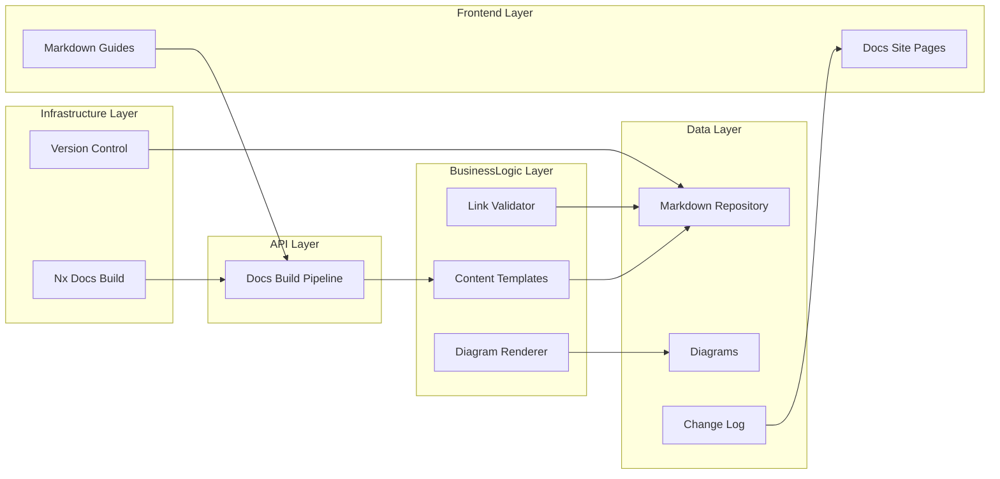
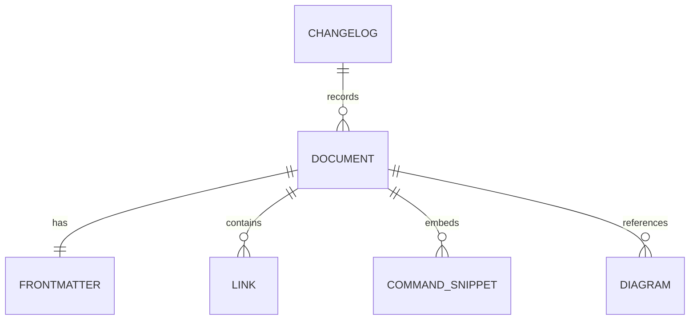
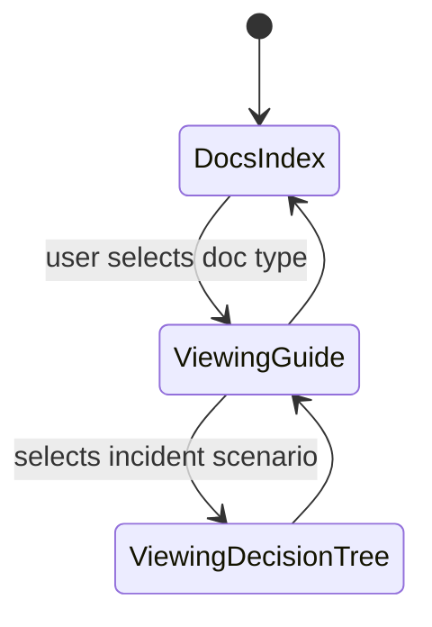

# Feature Implementation Plan — Edge Operational Documentation

## Goal

Create a unified documentation suite that guides engineers through deploying, operating, and troubleshooting the NGINX edge platform. The plan ensures every operational scenario—from onboarding services to responding to incidents—is covered with up-to-date instructions, diagrams, and references to automation. A disciplined documentation workflow will lower time-to-resolution during outages and support compliance reviews.

## Requirements

- Author core documents within `tools/nginx/docs/`:
  - `README.md`: architecture overview, component map, navigation index.
  - `QUICKSTART.md`: onboarding steps for new services.
  - `RUNBOOK.md`: incident response playbooks with decision trees.
  - `VALIDATION.md`: procedures for verifying deployments and health checks.
  - `CHANGELOG.md`: tracks updates and review approvals.
- Include diagrams (Mermaid) covering traffic flow, deployment topology, monitoring hooks; store `.mmd` sources in `tools/nginx/diagrams/`.
- Cross-link scripts, Nx targets, and configuration directories; embed command snippets with copyable format.
- Implement documentation linting (markdownlint, link checker) within Nx pipeline.
- Define documentation review workflow: owner assignments, verification steps, and review cadence annotated in changelog.

## Technical Considerations

### System Architecture Overview



- **Technology Stack Selection:** Markdown content processed via Next.js/MDX; Mermaid diagrams rendered using `@swiggy/mermaid` plugin during build.
- **Integration Points:** Documentation references Nx tasks (e.g., `nx run lb-frontend:test`) and scripts, linking to GitHub source. Build pipeline runs lint checks before publishing.
- **Deployment Architecture:** Docs compiled alongside app build; ensure static export includes new guides. Provide search index update.
- **Scalability Considerations:** Use templates for new sections; maintain metadata in frontmatter to support auto-indexing and search facets.

## Database Schema Design

No database; conceptual schema for documentation artifacts.



## API Design

Define frontmatter schema to standardize metadata and allow automated tooling to parse.

```yaml
---
title: "Edge Runbook"
owner: platform-team
lastReviewed: "2025-10-10"
tags: [runbook, edge]
---
```

Implement script checking for required fields; include Nx target `docs:lint-edge` to enforce.

## Frontend Architecture

Introduce documentation pages to Next.js site with accessible navigation.

- **Component Hierarchy:**
  - `EdgeDocsLayout`
    - `SidebarNavigation`
    - `ContentArea`
    - `CalloutPanel`
  - `RunbookDecisionTree` component for scenario navigation.
- **Styling:** CSS Modules SCSS abiding by guidelines; use high-contrast themes.
- **State Flow Diagram:**



## Security & Performance

- **Authentication:** Access limited to repo collaborators; sensitive info (escalation contacts) stored in private sections with placeholders for public repos.
- **Data Validation:** Pre-commit hook ensures command snippets tested (`tools/scripts/validate-doc-commands.sh`). Broken link checker runs in CI.
- **Performance:** Generate static pages; lazy-load diagrams; avoid heavy images.
- **Compliance:** Runbook includes audit checklist referencing log locations, health checks, and retention policies. Document review cadence to maintain compliance.

---

Documentation planning respects accessibility guidelines; perform manual review using Accessibility Insights to ensure final materials meet expectations.
