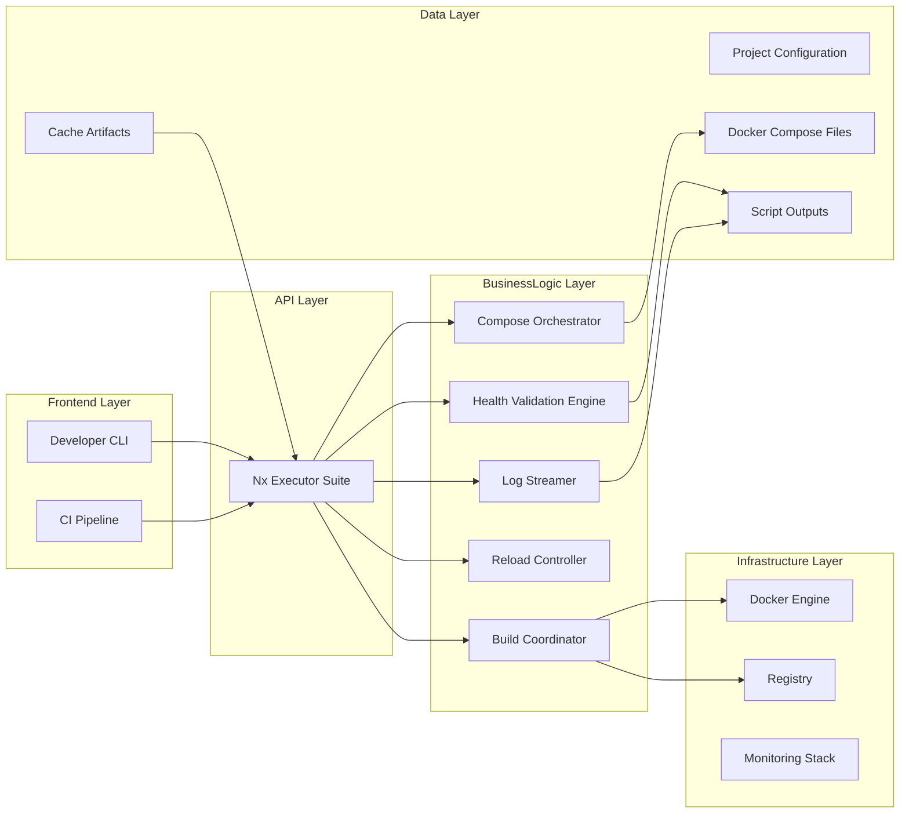
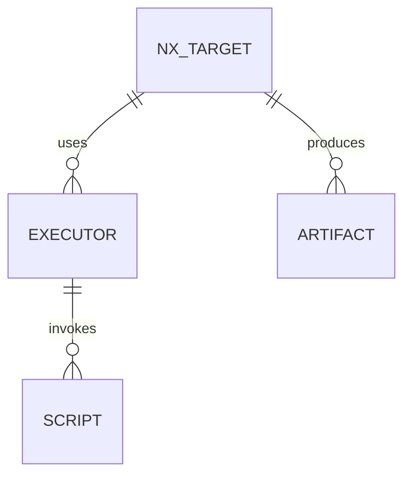
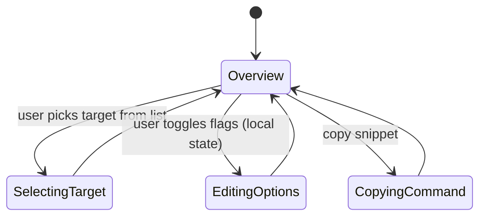

# Feature Implementation Plan — Nx Automation Suite

## Goal

Provide a cohesive set of Nx targets that orchestrate build, deploy, validation, reload, and log-tail workflows for the NGINX edge stack. The automation suite must integrate existing scripts and compose cleanly into CI pipelines, reducing manual effort and ensuring consistent operations across environments.

## Requirements

- Define Nx project `tools-nginx` (if not already) or extend existing with new targets:
  - `edge:build` — builds Docker images (gateway + load balancers) and optionally pushes to registry.
  - `edge:up` — brings up stack via Docker Compose overlays (TLS, monitoring) and waits for health checks.
  - `edge:down` — gracefully stops stack and cleans up resources.
  - `edge:reload` — executes rotation/reload scripts (`rotate-certs.sh` and `nginx -s reload`) verifying success.
  - `edge:validate` — runs health check scripts, linting, `nginx -t`, and optionally `testssl.sh` for TLS overlay.
  - `edge:logs` — tails structured logs from containers with filtering options.
- Leverage Nx `executor` definitions implemented in TypeScript (custom executors) to provide consistent interface and option parsing; fallback to `run-commands` for simple tasks.
- Introduce configuration schemas for each target, validated via `zod` or custom TypeScript types to enforce options such as `env`, `overlays`, `wait`.
- Provide remote caching metadata for build/validate tasks; ensure tasks produce deterministic outputs.
- Document dependencies between tasks (e.g., `edge:validate` depends on `edge:up`).
- Integrate with CI by adding pipeline job example referencing these targets and capturing artifacts (logs, reports).

## Technical Considerations

### System Architecture Overview



- **Technology Stack Selection:** Custom Nx executors written in TypeScript using Node’s child_process to invoke Docker, Compose, and scripts. Use `chalk` for output formatting and `ora` for spinners (accessible fallback to plain text when not interactive).
- **Integration Points:** Executors invoke existing scripts: `tools/nginx/validate.sh`, health check scripts, rotation workflow. Logging tailer integrates with `docker compose logs` using JSON parsing to highlight severity.
- **Deployment Architecture:** Nx tasks run locally or within CI containers; ensure `docker` socket accessible. Provide `.nxignore` updates for generated artifacts.
- **Scalability Considerations:** allow concurrency control; `edge:up` can accept `--services=` to start subset. Provide environment overrides via `.env.edge.local` files.

## Database Schema Design

No database. Conceptual relationships outlined below.



## API Design

Define TypeScript interfaces for options to ensure consistency.

```ts
interface EdgeBuildOptions {
  push?: boolean;
  registry?: string;
  tags?: string[];
  env?: "development" | "staging" | "production";
}

interface EdgeUpOptions {
  env?: "development" | "staging" | "production";
  overlays?: string[];
  waitForHealth?: boolean;
  timeoutSeconds?: number;
}
```

Executors validate options using `zod` and return structured results including status and artifact paths.

## Frontend Architecture

Add documentation page describing automation suite and interactive command explorer.

- **Component Hierarchy:**
  - `NxAutomationGuide`
    - `TargetOverviewTable`
    - `CommandPlayground`
    - `CIIntegrationExamples`
    - `TroubleshootingAccordion`
- **Styling:** CSS Modules/SCSS.
- **State Flow Diagram:**



## Security & Performance

- **Authentication/Authorization:** Document requirement for Docker permissions; suggest running within controlled environment (CI service account). Protect registry credentials via environment variables/secret store.
- **Data Validation:** Executors validate input values, sanitize shell arguments, and escape overlay lists to prevent injection.
- **Performance:** Optimize builds by layering caches (Docker BuildKit) and enabling Nx remote caching for `edge:build` results. Provide `--skip-build` option when images pre-built.
- **Observability:** Capture logs from each executor into `.nx/results` with structured metadata for troubleshooting.

---

Accessibility was considered for the planned documentation UI; follow up with manual testing (Accessibility Insights) to ensure compliance.
