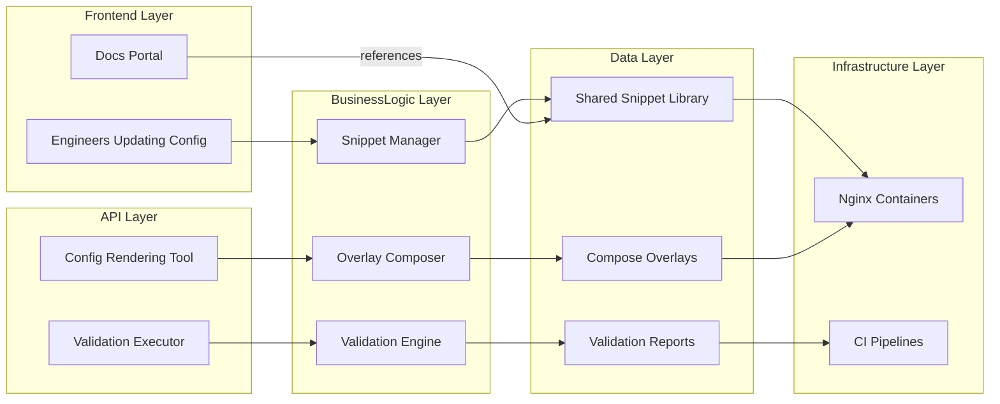
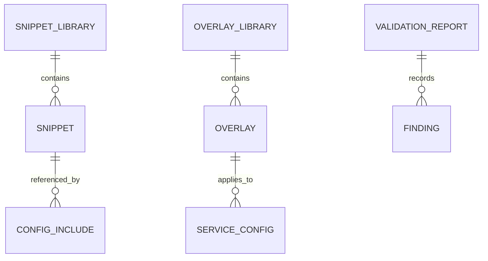
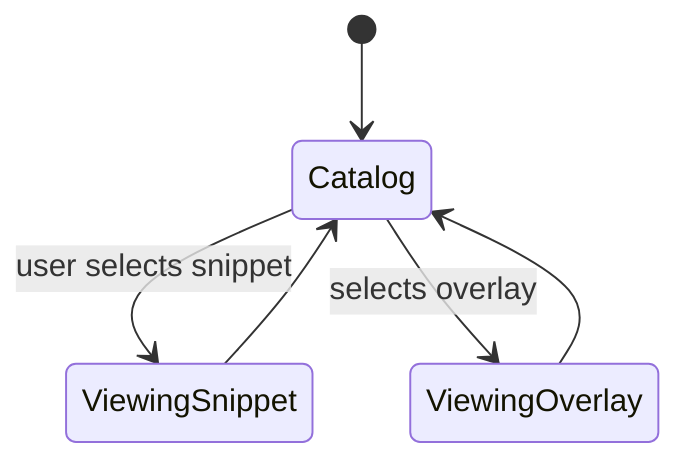

# Feature Implementation Plan — Shared Configuration Assets

## Goal

Establish a curated library of NGINX snippets and Docker Compose overlays that ensure consistent configuration across the edge platform. The plan centralizes headers, logging, and base settings while providing documented include patterns and validation tooling. This reduces configuration drift and accelerates onboarding for new services.

## Requirements

- Organize shared assets under `tools/nginx/common/`:
  - `snippets/headers.conf`, `snippets/logging.conf`, `snippets/tls.conf`, `snippets/cache.conf`.
  - `base.nginx.conf` template with placeholders for service-specific includes.
  - Compose overlays `overlays/development.yaml`, `overlays/production.yaml`.
- Update gateway and load balancer configs to consume shared snippets via `include /etc/nginx/snippets/...;` patterns.
- Provide Nx target `edge:lint-config` to lint (nginx-lint) and run `nginx -t` across all services using shared snippets.
- Implement script `tools/nginx/scripts/render-config.sh` to generate aggregated config for review (using envsubst or gomplate).
- Document include/override conventions in README with table that maps components to snippet usage.
- Maintain changelog tracking updates to shared assets and notify dependent teams when changes occur.

## Technical Considerations

### System Architecture Overview



- **Technology Stack Selection:** Snippets as plain NGINX config; overlay templating handled by Compose YAML with environment variables. Validation via custom Nx executor invoking `docker compose config` + `nginx -t`.
- **Integration Points:** Shared snippets used by gateway/load balancer configs; Compose overlays consumed by Nx automation suite. Documentation links to assets within repo.
- **Deployment Architecture:** Overlays layered atop base Compose files when running `edge:up`. Provide script to diff overlay vs base for review.
- **Scalability Considerations:** Introduce version tags for snippet releases to coordinate updates; maintain compatibility matrix in docs.

## Database Schema Design

No database; conceptual diagram for relationships.



## API Design

Expose configuration metadata via JSON manifest to aid docs and tooling.

```json
{
  "snippets": [
    { "name": "headers", "path": "tools/nginx/common/snippets/headers.conf", "description": "Security headers baseline" }
  ],
  "overlays": [
    { "name": "production", "path": "tools/nginx/common/overlays/production.yaml", "services": ["proxy-edge", "lb-frontend"] }
  ]
}
```

Manifest generated by script for docs and validation.

## Frontend Architecture

Enhance docs with `SharedConfigAssetsPage` summarizing available snippets and overlays.

- **Component Hierarchy:**
  - `SharedConfigAssetsPage`
    - `SnippetCatalog`
    - `OverlayComparisonTable`
    - `ValidationStatusBadge`
    - `OverrideGuidelines`
- **Styling:** CSS Modules/SCSS.
- **State Flow Diagram:**



## Security & Performance

- **Authentication:** Limit write access to shared assets via repository permissions; document review process for changes.
- **Data Validation:** `edge:lint-config` ensures includes resolve and overlay config valid. Implement diff check requiring PRs to pass validation before merge.
- **Performance:** Shared caching and header snippets should avoid redundant directives; ensure inclusion does not degrade startup time.
- **Compliance:** Snippets include mandatory headers and logging formats; documentation notes compliance requirements and references.

---

Accessibility informed the documentation plan, but please run manual checks (e.g., Accessibility Insights) to validate final outputs.
