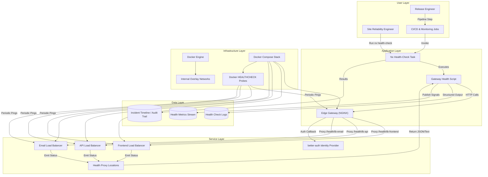

# Epic Architecture Specification — Unified Health Monitoring

## 1. Epic Architecture Overview

The unified health monitoring epic layers proxied health endpoints, orchestration scripts, and Nx automation onto the edge platform so operators can evaluate every load balancer through the gateway. Sequential health tasks, Docker health probes, and detailed documentation give fast feedback on routing readiness without exposing internal ports. The design preserves network isolation, standardizes responses for CI/CD integration, and creates a foundation for future observability integrations.

## 2. System Architecture Diagram

## 3. High-Level Features & Technical Enablers

### Features

- Gateway-exposed proxy endpoints (`/health/lb-*`) that surface internal load balancer health through a single ingress point.
- Nx-driven health check task producing sequential, human-readable reports for all edge components.
- Docker HEALTHCHECK integration leveraging the shared shell script for container-level probing.
- Comprehensive documentation set (integration guide, quick reference, before/after analysis, diagrams) to support operators and CI users.
- Extensible architecture for future JSON payloads, alerting hooks, and external monitoring adapters.

### Technical Enablers

- Health aggregator locations configured in NGINX with timeout handling and 503 responses for unhealthy upstreams.
- Shell-based health script supporting text and JSON modes, reusable by Nx tasks and Docker probes.
- Nx automation updates coordinating Compose lifecycle, health validation, and telemetry outputs.
- Structured logging and metrics stream capturing health transitions for audits and dashboards.
- Internal overlay networks maintaining isolation while still enabling the gateway to reach load balancers.

## 4. Technology Stack

- **Edge Components:** NGINX gateway and load balancers running in Docker containers with shared configuration snippets.
- **Automation:** Nx task runner, shell scripts for health aggregation, Docker HEALTHCHECK directives.
- **Security & Identity:** better-auth for any authentication callbacks exercised through the gateway.
- **Observability:** Structured logs, metrics signals, incident timeline artifacts suitable for ingestion by monitoring systems.
- **Infrastructure:** Docker Compose orchestration, internal networks, OCI registry for image distribution.

## 5. Technical Value

**Medium** — The epic significantly improves operational visibility with minimal infrastructure changes, unlocking faster incident response while laying groundwork for advanced monitoring without overhauling core routing behavior.

## 6. T-Shirt Size Estimate

**S (Small)** — The work focuses on NGINX configuration, scripting, and automation updates within the existing edge stack, keeping scope contained and predictable.
