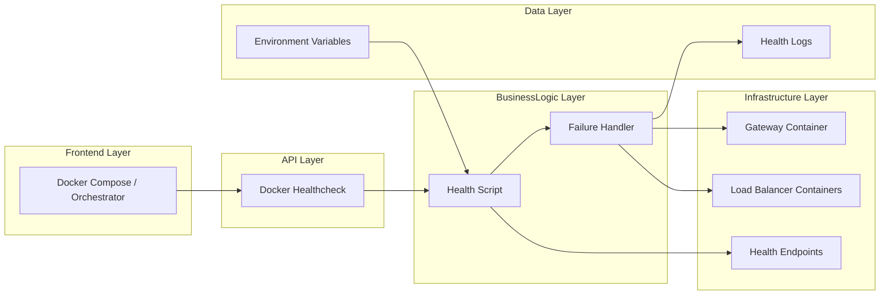
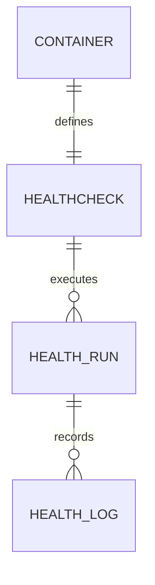
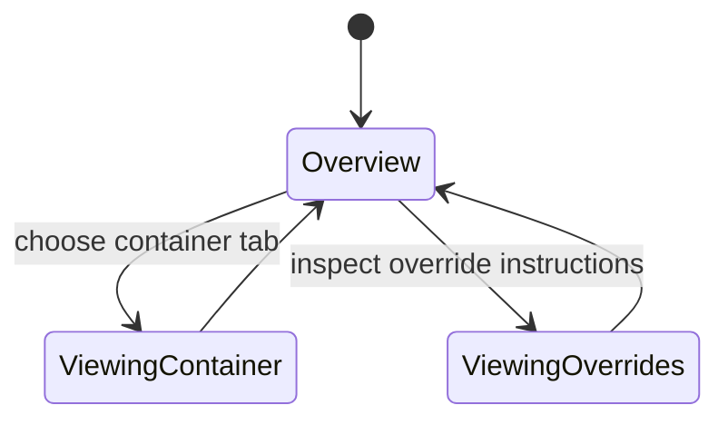

# Feature Implementation Plan — Docker Healthcheck Integration

## Goal

Embed standardized Docker `HEALTHCHECK` instructions into edge gateway and load balancer images, leveraging existing health endpoints to allow orchestrators to restart unhealthy containers automatically. The plan ensures consistent scripts, configurable thresholds, and documentation across services.

## Requirements

- Create shared healthcheck script (`tools/nginx/proxy-edge/scripts/health-check.sh`) reused by all containers.
- Update Dockerfiles for gateway and load balancers to copy script and define `HEALTHCHECK` directive with configurable interval, timeout, retries.
- Support environment variables for endpoint URL override, timeout, success threshold.
- Ensure script exits non-zero on failure and logs context to stdout/stderr.
- Update Docker Compose overlays to surface health status (`docker compose ps` shows healthy). Document Kubernetes readiness/liveness translation.
- Add Nx target `health:docker` executing `docker inspect` to verify health status and run integration test.
- Provide automated tests that run containers locally, simulate failure (endpoint returns 503), and confirm orchestrator marks container unhealthy.

## Technical Considerations

### System Architecture Overview



- **Technology Stack Selection:** Bash script using `curl` for HTTP checks; optional fallback to BusyBox `wget`. Healthcheck defined with `CMD ["/bin/sh","-c","/usr/local/bin/health-check.sh"]` for portability.
- **Integration Points:** Script hits gateway proxy health endpoints delivered by companion feature. Health logs forwarded to central logging; orchestrators rely on exit codes to restart containers.
- **Deployment Architecture:** Dockerfiles copied across services; Nx build pipeline ensures script packaged. Compose overlay sets healthcheck interval/timeout; Kubernetes manifests documented for parity.
- **Scalability Considerations:** Support multiple endpoints by allowing comma-separated list; script loops and fails if any unhealthy. Provide exponential backoff for retry to reduce load during outages.

## Database Schema Design

No database; conceptual mapping shown below.



## API Design

No HTTP API but environment variables control behavior:

```bash
export HEALTHCHECK_URL="http://localhost:8080/health"
export HEALTHCHECK_TIMEOUT=5
export HEALTHCHECK_RETRIES=3
export HEALTHCHECK_EXPECTED_STATUS=200
```

- Script parses env vars and CLI overrides (`health-check.sh --url=...`). Exit code `0` on success, `1` on failure.
- Error messages include structured JSON for log analytics.

## Frontend Architecture

Update documentation to describe Docker healthchecks.

- **Component Hierarchy:**
  - `DockerHealthcheckGuide`
    - `ContainerList`
    - `HealthStatusExamples`
    - `OverrideInstructions`
    - `TroubleshootingFaq`
- **Styling:** CSS Modules/SCSS.
- **State Flow Diagram:**



## Security & Performance

- **Authentication:** Ensure health endpoints require appropriate access (internal network, optional auth headers). Script avoids logging secrets.
- **Data Validation:** Validate URL inputs; ensure script handles DNS failures gracefully. Use `set -euo pipefail` to prevent silent errors.
- **Performance:** Default interval 30s, timeout 5s; make configurable. Use keepalive connections when possible.
- **Observability:** Logs include timestamp, endpoint, HTTP status. Document integration with unified monitoring for alerting on repeated failures.

---

Accessibility considerations informed documentation planning; perform manual verification with Accessibility Insights during implementation.
