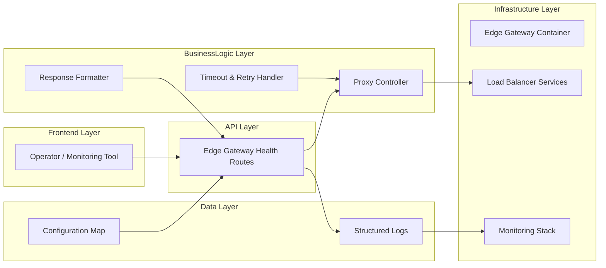
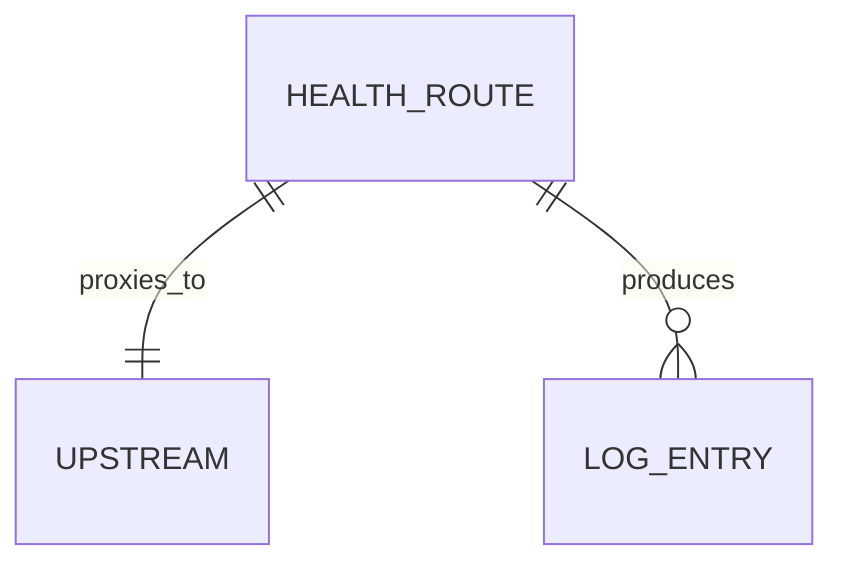
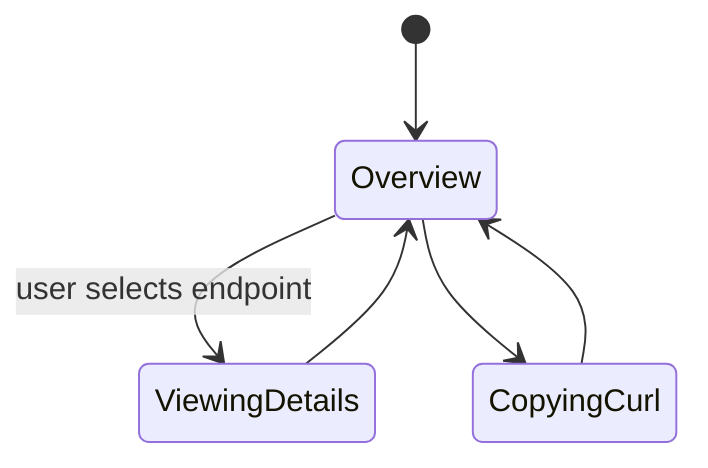

# Feature Implementation Plan — Gateway Proxy Health Endpoints

## Goal

Expose standardized health endpoints through the edge gateway that proxy to workload-specific load balancers. The feature enables operators and automation to validate service readiness without directly accessing internal containers, reducing incident response time and improving observability. Endpoints must provide clear success/failure semantics, secure access, and comprehensive logging.

## Requirements

- Extend gateway config to define `/health/lb-frontend`, `/health/lb-api`, `/health/lb-email` routes.
- Proxy requests to corresponding load balancer health endpoints over internal network with configurable timeouts and retries.
- Enforce security controls: IP allowlist, rate limiting, and optional auth header checks.
- Implement failure handling: return HTTP 503 with descriptive JSON payload when upstream unhealthy or timeout occurs.
- Log requests/responses including correlation IDs, upstream status, latency.
- Provide Nx task `health:gateway-endpoints:test` that issues HTTP probes and reports results.
- Document usage in health documentation suite with curl examples and expected responses.

## Technical Considerations

### System Architecture Overview



- **Technology Stack Selection:** NGINX configuration using `proxy_pass` with `proxy_connect_timeout`, `proxy_read_timeout`, `proxy_next_upstream`. Lua or map blocks to format JSON responses.
- **Integration Points:** Logs shipped to central monitoring; optionally integrate with alerting by parsing 503 responses. Security controls reuse shared snippets for rate limiting.
- **Deployment Architecture:** Config updates rolled out via Nx automation; ensure zero downtime reload with `edge:reload` target.
- **Scalability Considerations:** Support future endpoints by templating configuration (map host to upstream). Document pattern for dynamic includes.

## Database Schema Design

No database; conceptual mapping.



## API Design

Define response schema for health endpoints.

```json
{
  "service": "lb-frontend",
  "status": "healthy",
  "upstream": "lb-frontend:8080",
  "latencyMs": 32,
  "timestamp": "2025-10-13T02:45:00Z"
}
```

- Errors include `status: "unhealthy"`, `reason`, and recommended action.
- Security: allowlist networks via config, optional API key header for automated tools.

## Frontend Architecture

Enhance docs page describing endpoints.

- **Component Hierarchy:**
  - `GatewayHealthDocs`
    - `EndpointTable`
    - `ResponseExample`
    - `SecurityGuidance`
    - `IntegrationInstructions`
- **Styling:** CSS Modules/SCSS.
- **State Flow Diagram:**



## Security & Performance

- **Authentication/Authorization:** Apply IP allowlist or token-based access to avoid exposing health info publicly. Document enabling Basic Auth or mTLS if required.
- **Data Validation:** Sanitize upstream responses before returning; ensure no sensitive headers leaked.
- **Performance:** Default timeout <2s; use keepalive connections to load balancers. Retry limited to one attempt to avoid cascading load.
- **Logging:** Capture correlation IDs via header (`X-Request-ID`), include upstream status for audit trails.

---

Accessibility considerations guided documentation layout and logging messaging; run manual checks (Accessibility Insights) during implementation to verify compliance.
