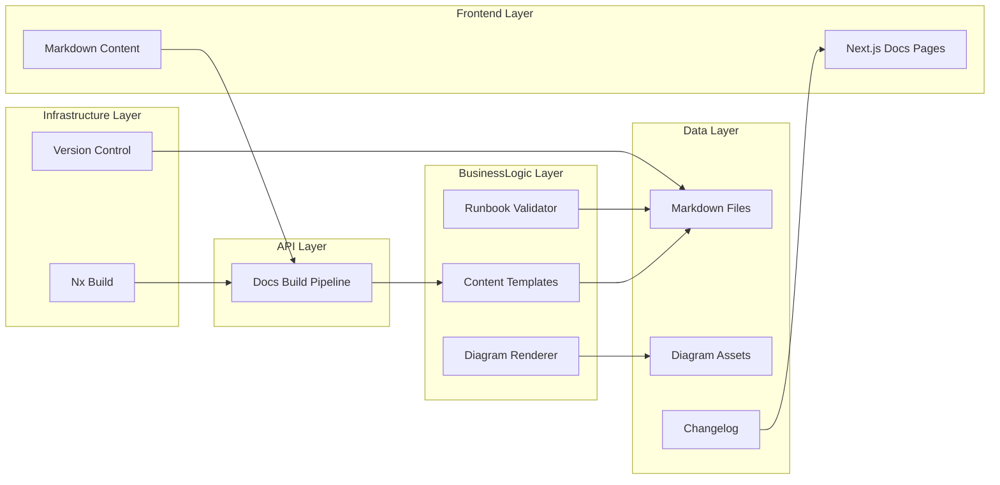
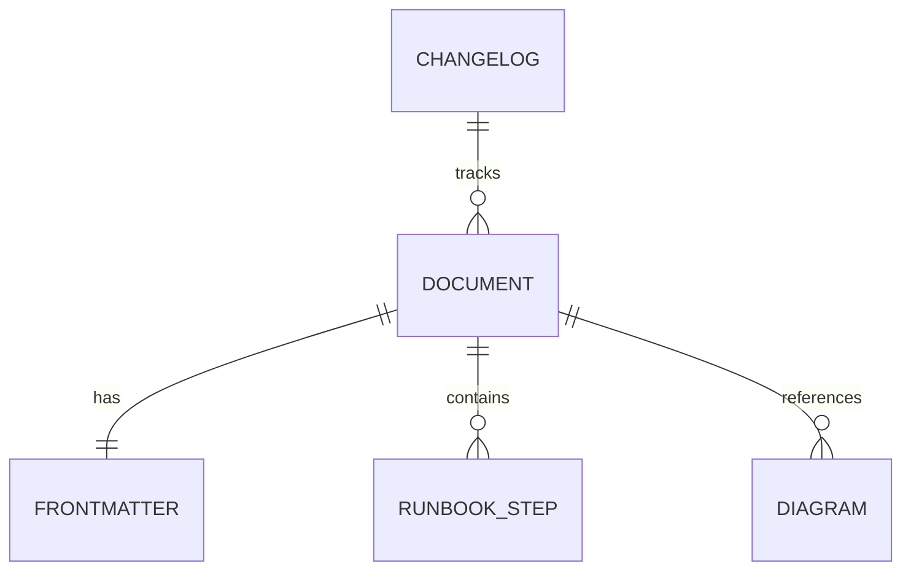
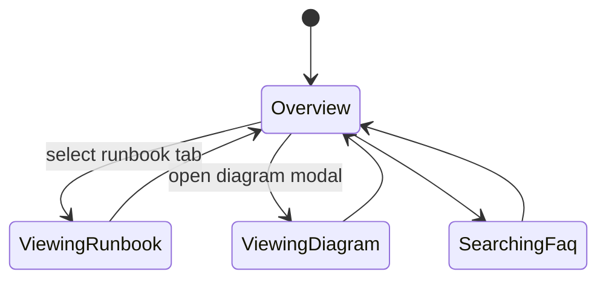

# Feature Implementation Plan — Health Documentation Suite

## Goal

Produce a comprehensive documentation bundle that explains the unified health monitoring stack, from gateway endpoints to Docker healthchecks and Nx automation. The suite must equip engineers with runbooks, diagrams, FAQs, and troubleshooting guides that keep operations consistent and audit-ready.

## Requirements

- Organize content under `tools/nginx/docs/health/` with sections: Overview, Runbooks, Troubleshooting, FAQ, Changelog.
- Author guides covering endpoint usage, Nx health task, Docker healthchecks, and observability adapters.
- Include diagrams (Mermaid) depicting request flow and component relationships; validate with lint pipeline.
- Provide runbooks with step-by-step procedures and verification checkpoints.
- Publish changelog entries when health tooling changes; include review metadata.
- Integrate documentation into Next.js docs site with navigation entry and search metadata.

## Technical Considerations

### System Architecture Overview



- **Technology Stack Selection:** Markdown processed with MDX/Remark; Mermaid diagrams compiled during build.
- **Integration Points:** Docs link to scripts, Nx commands, and health API responses. Build pipeline runs lint and diagram validation.
- **Deployment Architecture:** Static pages incorporated into `my-programs-app` docs route with versioned URLs.
- **Scalability Considerations:** Template generator for new guides; metadata stored in frontmatter for search indexing.

## Database Schema Design

No database; conceptual relationships only.



## API Design

Frontmatter schema ensures consistency.

```yaml
---
title: "Gateway Health Runbook"
lastReviewed: "2025-10-13"
owners: [platform-team]
tags: [health, runbook]
---
```

## Frontend Architecture

Add documentation components within Next.js site.

- **Component Hierarchy:**
  - `HealthDocsLayout`
    - `RunbookSection`
    - `FaqAccordion`
    - `CommandSnippet`
    - `DiagramGallery`
- **Styling:** CSS Modules/SCSS.
- **State Flow Diagram:**



## Security & Performance

- **Authentication:** Docs remain internal; ensure sensitive escalation contacts stored securely.
- **Validation:** Pre-commit hooks run markdownlint, link check, and ensures runbook steps list verification checkpoints.
- **Performance:** Keep diagrams lightweight; lazy load with placeholders. Build pipeline caches diagram renders to reduce build time.
- **Compliance:** Runbooks include audit references (log locations, commands) and verification steps for each workflow.

---

Documentation is planned with accessibility principles; confirm compliance using Accessibility Insights during final review.
