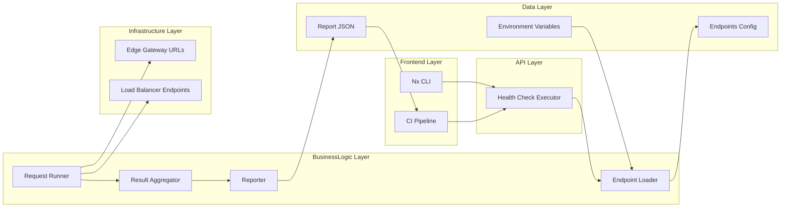
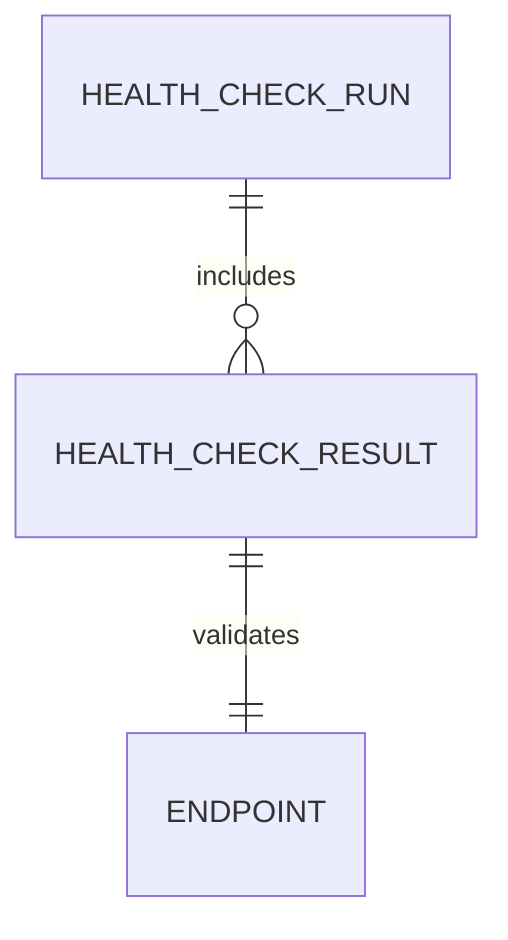
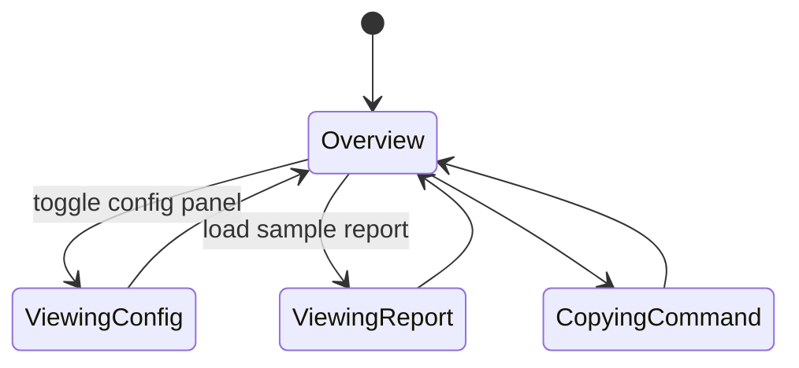

# Feature Implementation Plan — Nx Health Check Task

## Goal

Deliver an Nx command that performs automated HTTP checks against gateway and load balancer health endpoints, enabling CI pipelines and engineers to verify service readiness quickly. The task must provide structured reporting, configurable targets, and cross-platform support, reducing manual validation across environments.

## Requirements

- Implement Node/TypeScript script (`tools/nginx/scripts/health/check.ts`) leveraging `node-fetch` or Axios.
- Script should read configuration from JSON (`tools/nginx/scripts/health/endpoints.json`) or CLI overrides (flags: `--endpoints`, `--timeout`, `--retry`).
- Build Nx target `health:run` (alias `nginx-health:check`) using custom executor returning structured result.
- Output summary to console plus JSON report stored under `tools/nginx/scripts/health/reports/` with schema version.
- Support environment filters (`--env=staging`) to select subset of endpoints; integrate with `.env` file for base URLs.
- Provide unit tests and integration tests (Jest) covering success, failure, timeout, and retry logic.
- Document usage examples for local dev and CI, referencing the new documentation suite.

## Technical Considerations

### System Architecture Overview



- **Technology Stack Selection:** TypeScript script with `undici` HTTP client for performance, `zod` for config validation, `ora` for CLI feedback (with non-interactive fallback).
- **Integration Points:** Report consumed by documentation and potential observability adapters. After execution, optionally trigger Slack/webhook notifications (future).
- **Deployment Architecture:** Script distributed with repo; run locally or in CI containers using Node 20.x.
- **Scalability Considerations:** Support parallel requests with concurrency control; allow dynamic addition of new endpoints by updating config file.

## Database Schema Design

No database; conceptual diagram.



## API Design

Define TypeScript types for config and results.

```ts
interface HealthEndpoint {
  name: string;
  url: string;
  method?: "GET" | "HEAD";
  expectedStatus?: number;
  timeoutMs?: number;
}

interface HealthRunReport {
  schemaVersion: "1.0";
  startedAt: string;
  finishedAt: string;
  environment: string;
  results: Array<{
    endpoint: string;
    status: "pass" | "fail";
    httpStatus?: number;
    latencyMs?: number;
    error?: string;
  }>;
}
```

- Error handling: fail fast with exit code 1 if any endpoint fails (unless `--allow-failures` specified).
- Rate limiting: throttle concurrency with `p-limit` to avoid overwhelming gateway.

## Frontend Architecture

Update docs page summarizing health check usage.

- **Component Hierarchy:**
  - `HealthCheckGuide`
    - `EndpointList`
    - `CommandExamples`
    - `ReportViewer`
  - Use CSS Modules/SCSS per convention.
- **State Flow Diagram:**



## Security & Performance

- **Authentication:** Allow injection of auth headers or tokens via environment variables; ensure secrets not logged.
- **Data Validation:** Validate URLs and expected statuses; warn on insecure HTTP endpoints. Sanitize CLI input.
- **Performance:** Concurrency limit to 5 by default; adjustable via flag. Timeout default 2 seconds.
- **Caching:** None; each run executes live checks. Use Nx caching to skip re-runs in CI when endpoints unchanged (optional).

---

Accessibility considerations guided documentation updates; manual verification with Accessibility Insights is recommended.
