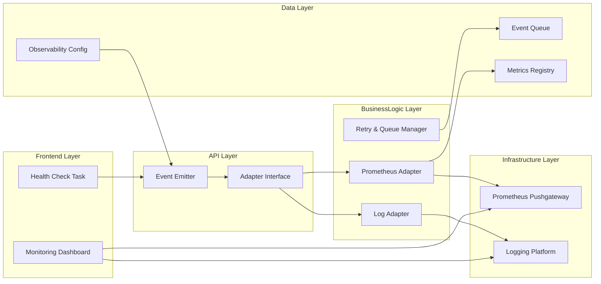
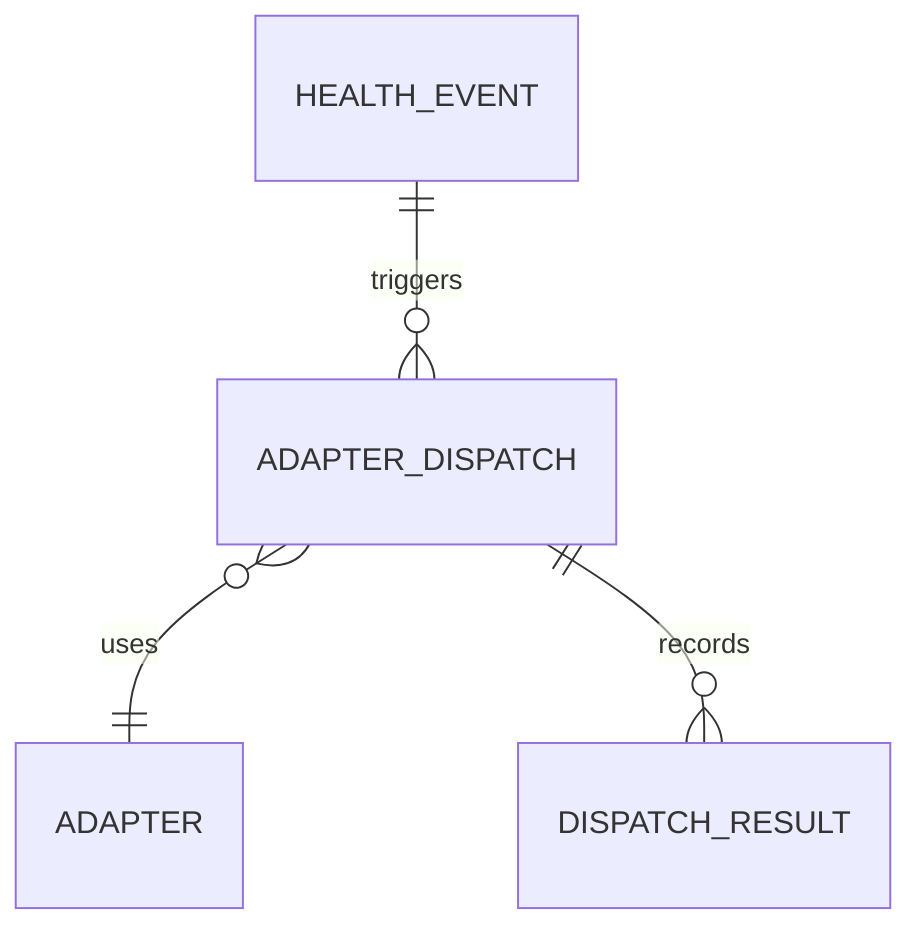
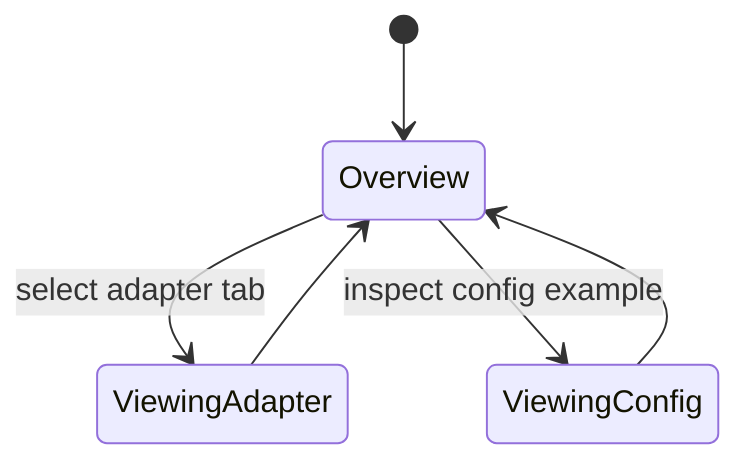

# Feature Implementation Plan — Observability Extensibility

## Goal

Design extension points that export health monitoring data to external observability platforms such as Prometheus and logging stacks. The feature must provide a standardized event schema, adapter interface, and configuration mechanism, enabling teams to integrate new tools with minimal effort.

## Requirements

- Implement event emitter module in TypeScript (`tools/nginx/scripts/health/events.ts`) that converts health check results into structured events.
- Define adapter interface supporting `publish(event)` with adapters for Prometheus metrics (via Pushgateway or exporter) and structured log sink.
- Expose configuration via JSON/YAML (`observability.config.json`) and environment variables to enable/disable adapters and supply credentials.
- Update Nx health check task to emit events through adapters after each run.
- Provide retry and backoff mechanisms for adapter failures, queueing events temporarily.
- Document how to create new adapters with examples and testing guidance.

## Technical Considerations

### System Architecture Overview



- **Technology Stack Selection:** TypeScript for event bus, `prom-client` for metrics, `pino` or native JSON logging for log adapter. Retry queue implemented with `p-queue`.
- **Integration Points:** Event emitter called from Nx health task and Docker healthcheck script (optional). Metrics surfaced through Prometheus Pushgateway; logs piped to Fluent Bit or file sink.
- **Deployment Architecture:** Configuration file stored under `tools/nginx/observability/`; Nx executor reads config and sets up adapters before running checks. Provide sample docker-compose service for Pushgateway.
- **Scalability Considerations:** Support multiple adapters concurrently; ensure queue bounded to avoid memory spikes. Provide backpressure with drop policies configurable per environment.

## Database Schema Design

No traditional database; represent event relationships conceptually.



## API Design

Define TypeScript interfaces for events and adapters.

```ts
interface HealthEvent {
  service: string;
  status: "healthy" | "unhealthy";
  latencyMs: number;
  checkedAt: string;
  metadata?: Record<string, unknown>;
}

interface ObservabilityAdapter {
  name: string;
  publish: (event: HealthEvent) => Promise<void>;
  shutdown?: () => Promise<void>;
}
```

Configuration example:

```json
{
  "adapters": [
    { "type": "prometheus", "endpoint": "http://localhost:9091" },
    { "type": "log", "level": "info" }
  ],
  "queue": { "maxSize": 100, "retryIntervalMs": 5000 }
}
```

## Frontend Architecture

Document observability options within Next.js docs.

- **Component Hierarchy:**
  - `ObservabilityGuide`
    - `AdapterCatalog`
    - `ConfigurationExamples`
    - `MetricPreview`
    - `TroubleshootingFaq`
- **Styling:** CSS Modules/SCSS.
- **State Flow Diagram:**



## Security & Performance

- **Authentication:** Adapters must support secure endpoints; document handling of credentials via env vars (e.g., `PROM_PUSH_USER/SECRET`). Avoid logging secrets.
- **Data Validation:** Validate config schema with `zod`; fail fast if adapter misconfigured. Sanitize event metadata before logging.
- **Performance:** Batch metric pushes where possible; keep queue bounded and apply exponential backoff for failing endpoints.
- **Observability:** Log adapter errors with severity, emit metrics about queue length and dispatch success rate.

---

Accessibility considerations guided documentation planning; confirm compliance through manual testing with Accessibility Insights.
