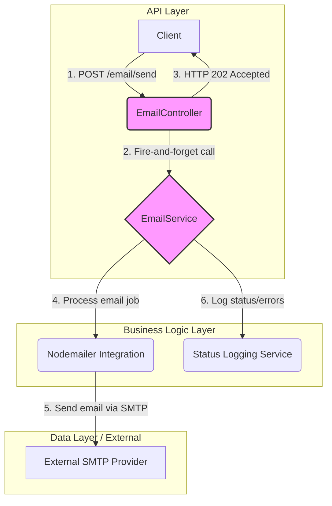

# Implementation Plan: Asynchronous Email Sending

## Goal

This feature aims to decouple the API's response from the actual email sending process. Currently, a synchronous operation could block the main thread, leading to poor performance and potential request timeouts, especially if the external SMTP provider is slow. By handling the email sending process asynchronously, the API can immediately acknowledge the request with a `202 Accepted` response, ensuring the service remains fast, responsive, and reliable, thereby significantly improving the user experience for programmatic clients.

## Requirements

- The `EmailController` must not block the HTTP response by waiting for the email sending process to complete.
- Upon receiving a validated request, the API must immediately return a `202-Accepted` status code.
- The task of sending the email via the SMTP provider will be executed as a non-blocking, background process.
- The API response time must be under 200ms.
- The asynchronous process must include robust error handling to catch and log any failures during SMTP communication.
- The design must support horizontal scaling, allowing multiple service instances to process email jobs independently.

## Technical Considerations

### System Architecture Overview

The core of this feature is to adopt a "fire-and-forget" pattern within the NestJS controller. The controller will delegate the email sending task to the `EmailService` but will not `await` its completion. This ensures the event loop is not blocked, allowing the controller to return a response to the client immediately. The `EmailService` will then handle the communication with the SMTP provider in the background.



- **Technology Stack Selection**:
  - **NestJS**: The core framework provides the necessary structure for controllers and services. Its dependency injection system is used to provide the `EmailService` to the `EmailController`. No additional libraries are needed for this specific asynchronous pattern.
- **Integration Points**:
  - `EmailController` -> `EmailService`: The controller will invoke a method on the service (e.g., `sendEmailAsync`).
  - `EmailService` -> `StatusLoggingService`: The service will use a logging service to record the outcome of the background job.
- **Deployment Architecture**: This feature fits within the existing Docker containerization strategy for the email microservice. No changes are required.
- **Scalability Considerations**: The stateless, fire-and-forget nature of this implementation supports horizontal scaling. Multiple instances of the service can run behind a load balancer, and each can handle background tasks independently. Since there is no shared job queue (as it's out of scope), there are no contention issues.

### Database Schema Design

No changes to the database schema are required for this feature. The responsibility for persisting status information lies with the `status-logging` feature.

### API Design

- **Endpoint**: `POST /email/send`
- **Request Format**: The endpoint will accept a `SendEmailDto` with fields for `to`, `subject`, and `body`. Validation will be handled by a `ValidationPipe`.

    ```typescript
    // libs/dtos/send-email.dto.ts
    class SendEmailDto {
      to: string;
      subject: string;
      body: string;
    }
    ```

- **Response Format**:
  - **Success**: `202 Accepted` with an empty body.
  - **Error**: Standard `400` (Bad Request) for validation failures or `401/403` for authorization failures.
- **Authentication**: The endpoint will be protected by the `BetterAuthGuard`, ensuring only authorized services can use it.
- **Error Handling**:
  - Synchronous errors (validation, auth) will be handled by NestJS pipes and guards, returning appropriate HTTP status codes.
  - Asynchronous errors (e.g., SMTP connection failure) will be caught within the `EmailService` background process and logged using the `StatusLoggingService`. They will not result in an HTTP error response to the original caller.
- **Rate Limiting**: A rate limiter will be applied to the endpoint to prevent abuse, configured to a sensible limit for service-to-service communication.

### Frontend Architecture

Not applicable. This is a backend-only feature.

### Security & Performance

- **Authentication/Authorization**: All requests to the endpoint must be authenticated via the service-to-service authentication mechanism (`BetterAuthGuard`).
- **Data Validation**: Incoming request bodies will be strictly validated against the `SendEmailDto` using `class-validator`.
- **Performance Optimization**: The primary goal of this feature is performance. By adopting the asynchronous pattern, the API's response time is decoupled from the performance of the external SMTP provider, ensuring it remains below the 200ms target.
- **Caching**: No caching strategy is applicable for this feature, as every request is a unique command to send an email.
