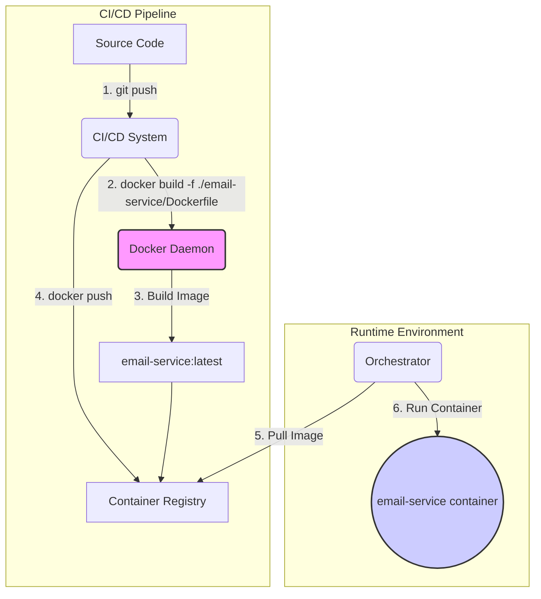

# Implementation Plan: Base Docker Image

## Goal

This technical enabler is focused on creating a standardized, multi-stage `Dockerfile` for the `email-service` application. The primary goal is to package the microservice into a consistent and reliable container, which is fundamental for a cloud-native architecture. The resulting Docker image will be optimized for production, ensuring it is small, secure, and efficient, thereby simplifying the deployment process and ensuring consistency between development and production environments.

## Requirements

- A `Dockerfile` must be created in the root of the `email-service` application directory.
- The build process must use a multi-stage approach to separate build-time dependencies from runtime dependencies.
- The `builder` stage will install all necessary dependencies (including `devDependencies`) and compile the Nest.js application.
- The final `production` stage will copy only the necessary build artifacts (e.g., `dist` folder, `node_modules`, `package.json`) from the `builder` stage.
- The final stage must install only production dependencies to keep the image lean.
- The final image must be based on a minimal and secure Node.js image, such as `node:22-alpine`.
- The container must run as a dedicated, non-root user to enhance security.
- The `CMD` instruction must be correctly configured to start the Nest.js application.
- The build process should leverage Docker's layer caching to ensure fast subsequent builds.

## Technical Considerations

### System Architecture Overview

This enabler resides entirely within the Infrastructure Layer. The `Dockerfile` is a blueprint that defines how the `email-service` application is packaged. It will be consumed by a CI/CD pipeline, which builds the image and pushes it to a container registry. The container orchestration system then pulls this image to run the service.



- **Technology Stack Selection**:
  - **Docker**: The industry standard for containerization. It provides the necessary tools to build, ship, and run the application in an isolated environment.
- **Integration Points**:
  - **CI/CD System**: The `Dockerfile` will be invoked by the CI/CD pipeline (e.g., GitHub Actions) to automate the build and push process.
  - **Container Registry**: The resulting image will be stored in a registry (e.g., Docker Hub, AWS ECR, Google GCR).
- **Deployment Architecture**: The output is a self-contained Docker image. The strategy involves a multi-stage build to create a minimal production image.
- **Scalability Considerations**: The container image will be stateless, allowing it to be scaled horizontally by the container orchestration platform.

### Database Schema Design

Not applicable. This enabler does not involve database changes.

### API Design

Not applicable. This enabler does not define or alter any APIs.

### Frontend Architecture

Not applicable. This is a backend-only enabler.

### Security & Performance

- **Authentication/Authorization**: Not applicable at the image build level.
- **Data Validation**: Not applicable.
- **Performance Optimization**:
  - **Build Time**: The `Dockerfile` will be structured to maximize Docker's layer caching. For example, `package.json` will be copied and dependencies installed in a separate layer before copying the rest of the source code.
  - **Image Size**: A multi-stage build is critical. The final image will not contain `devDependencies` or the TypeScript source code, only the compiled JavaScript and production dependencies. Using an Alpine-based Node.js image will further reduce the size.
- **Security**:
  - **Non-Root User**: A dedicated user and group will be created within the Docker image, and the `USER` instruction will be used to switch to this user before the application starts. This prevents processes within the container from running with root privileges.
  - **Minimal Base Image**: Using `node:22-alpine` reduces the attack surface by excluding unnecessary system libraries and tools.
  - **Dependency Scanning**: The CI/CD pipeline should be configured to scan the final image for known vulnerabilities in its dependencies.
- **Caching**: Docker layer caching will be used to speed up build times.

#### Pseudocode for `Dockerfile`

```dockerfile
# ---- Builder Stage ----
FROM node:22-alpine AS builder

WORKDIR /usr/src/app

# Copy package files and install all dependencies
COPY package*.json ./
RUN npm install

# Copy the rest of the source code
COPY . .

# Build the application
RUN npm run build email-service

# ---- Production Stage ----
FROM node:22-alpine AS production

# Create a non-root user
RUN addgroup -S appgroup && adduser -S appuser -G appgroup
USER appuser

WORKDIR /usr/src/app

# Copy package files and install only production dependencies
COPY package*.json ./
RUN npm ci --omit=dev

# Copy build artifacts from the builder stage
COPY --from=builder /usr/src/app/dist ./dist

# Expose the application port
EXPOSE 3000

# Command to start the application
CMD ["node", "dist/services/email-service/main.js"]
```
