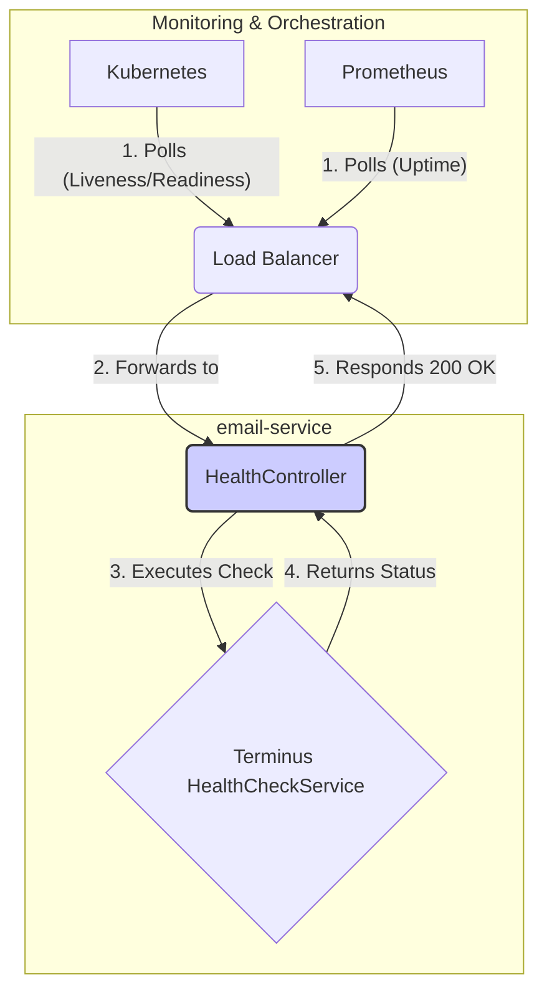

# Implementation Plan: Health Check Endpoint

## Goal

To implement a lightweight, unauthenticated `GET /health` endpoint in the `email-service` application. This endpoint will serve as a simple health probe for container orchestration systems and monitoring tools, indicating that the service's HTTP server is running and responsive.

## Requirements

- Create a `GET /health` endpoint.
- The endpoint must be public (no authentication).
- It must return a `200 OK` status with a JSON body of `{"status": "ok"}`.
- The implementation should be fast and have no external dependencies (like database connections).
- NestJS's built-in `@nestjs/terminus` module is the preferred tool for this.

## Technical Considerations

### System Architecture Overview

The health check endpoint is a simple, self-contained feature within the application. It hooks into the existing Nest.js routing mechanism. The `@nestjs/terminus` module provides a standardized way to build health checks.



- **Technology Stack Selection**:
  - **`@nestjs/terminus`**: This is the official and recommended Nest.js module for health checks. It provides a robust and extensible framework for creating health indicators. For this simple case, we will use its default `HttpHealthIndicator`.
  - **Nest.js Controllers**: The endpoint will be implemented in a dedicated `HealthController`.

- **Integration Points**:
  - **Application Routing**: The `HealthController` will be registered in the main `AppModule` to make the `/health` route available.
  - **Container Orchestration**: This endpoint is the primary integration point for Kubernetes' liveness and readiness probes. The orchestrator will periodically call this endpoint to determine the health of the container.

### File Structure

The following files will be created/modified within `services/my-nest-js-email-microservice/src/`:

```sh
health/
└── health.controller.ts
app.module.ts // Modified to import HealthController
```

### Implementation Details

1. **Install Dependency**:

   ```sh
   pnpm -w install @nestjs/terminus
   ```

2. **`health.controller.ts`**:
   - Create a new controller named `HealthController`.
   - Define a `GET` route for `/health`.
   - Inject the `HealthCheckService` and `HttpHealthIndicator` from `@nestjs/terminus`.
   - The route handler will call `health.check()` with the `HttpHealthIndicator` to confirm the app is running.

   ```typescript
   import { Controller, Get } from '@nestjs/common';
   import { HealthCheck, HealthCheckService, HttpHealthIndicator } from '@nestjs/terminus';

   @Controller('health')
   export class HealthController {
     constructor(
       private health: HealthCheckService,
       private http: HttpHealthIndicator,
     ) {}

     @Get()
     @HealthCheck()
     check() {
       // The check is simple: if the app is running, this will return a 200 OK.
       // The pingCheck is a basic indicator that the HTTP server is responsive.
       return this.health.check([
         () => this.http.pingCheck('nestjs-app', 'http://localhost:3000/health/ping'),
       ]);
     }

     @Get('ping')
     ping() {
       return 'pong';
     }
   }
   ```

   *Note: A simple `ping` endpoint is added for the health indicator to call. This is a common pattern to ensure the event loop is not blocked.*

3. **`app.module.ts`**:
   - Import `TerminusModule` and `HealthController` into the main `AppModule`.

   ```typescript
   // ... other imports
   import { TerminusModule } from '@nestjs/terminus';
   import { HealthController } from './health/health.controller';

   @Module({
     imports: [
       // ... other modules
       TerminusModule,
     ],
     controllers: [AppController, HealthController],
     providers: [AppService],
   })
   export class AppModule {}
   ```

### Security & Performance

- **Security**: The endpoint is intentionally public and provides no sensitive information, so there are no direct security risks. It is excluded from the S2S authentication guard.
- **Performance**: The check is extremely lightweight and fast, involving a simple internal HTTP ping. It will have a negligible impact on overall application performance.
