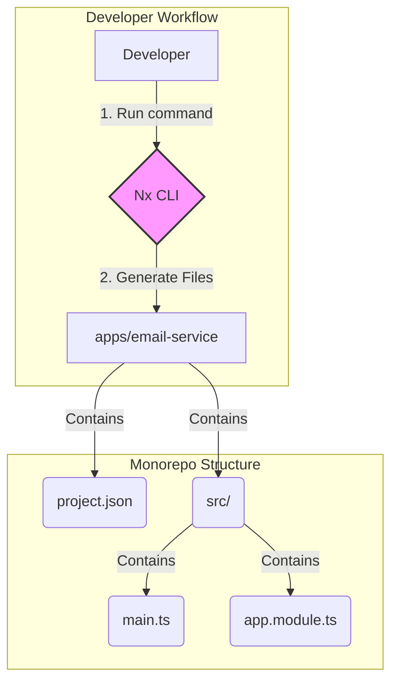

# Implementation Plan: New Nx Application

## Goal

The primary goal of this technical enabler is to establish a dedicated, isolated, and well-structured home for the new Nest.js Email Microservice within the existing Nx monorepo. By generating a new application using Nx's official `@nx/nest` generator, we create a standardized foundation. This ensures that the microservice can be developed, tested, built, and deployed independently, while still benefiting from the monorepo's shared tooling, libraries, and streamlined developer workflow.

## Requirements

- A new Nest.js application named `email-service` must be generated within the `apps` directory.
- The application must be configured with its own project configuration (`project.json` or in `package.json`), defining targets for `build`, `serve`, `test`, and `lint`.
- The generated application must include the default Nest.js boilerplate files (`main.ts`, `app.module.ts`, etc.).
- The application must be immediately runnable in a development environment using the `nx serve email-service` command.
- The default test suite must pass when run with `nx test email-service`.

## Technical Considerations

### System Architecture Overview

This enabler is a foundational step that occurs at the development tooling and file system level. It does not introduce new runtime components but rather scaffolds the project structure where those components will live. The process involves a developer using the Nx CLI to generate the application structure.



- **Technology Stack Selection**:
  - **Nx (`@nx/nest` plugin)**: Chosen as the core tool for managing the monorepo. Its generators provide a consistent and battle-tested way to scaffold new applications, ensuring they are correctly integrated into the workspace's dependency graph and task execution system.
  - **Nest.js**: Selected as the backend framework for the microservice, as defined by the epic's architecture.
- **Integration Points**:
  - **Nx Workspace**: The new `email-service` application will be registered in the Nx project graph, making it discoverable by other projects and enabling commands like `nx affected`.
  - **TypeScript Configuration**: The application will extend the base `tsconfig.base.json` from the monorepo root, ensuring consistent compiler options.
- **Deployment Architecture**: While this enabler does not deploy the application, it creates the necessary build artifacts (`dist/apps/email-service`) that a deployment script or Dockerfile will consume.
- **Scalability Considerations**: Using Nx to structure the application from the start allows for clear separation of concerns. As the service grows, new libraries (`libs`) can be generated and cleanly imported into the `email-service` app, promoting code reuse and maintainability.

### Database Schema Design

Not applicable. This enabler does not involve database changes.

### API Design

Not applicable. The only API endpoint will be the default one generated by Nest.js for health checks (`GET /`), which will be modified or removed later.

### Frontend Architecture

Not applicable. This is a backend-only enabler.

### Security & Performance

- **Security**: The generated application will have its own set of dependencies defined in its `package.json`, allowing for targeted security audits (e.g., with `npm audit`).
- **Performance**: Nx's build caching will be automatically enabled for the new application. This means that if the application's source code has not changed, subsequent builds will be retrieved from the cache, significantly speeding up CI/CD pipelines.

#### CLI Command for Generation

The following command will be executed from the root of the monorepo to generate the application:

```sh
npx nx g @nx/nest:app email-service
```
