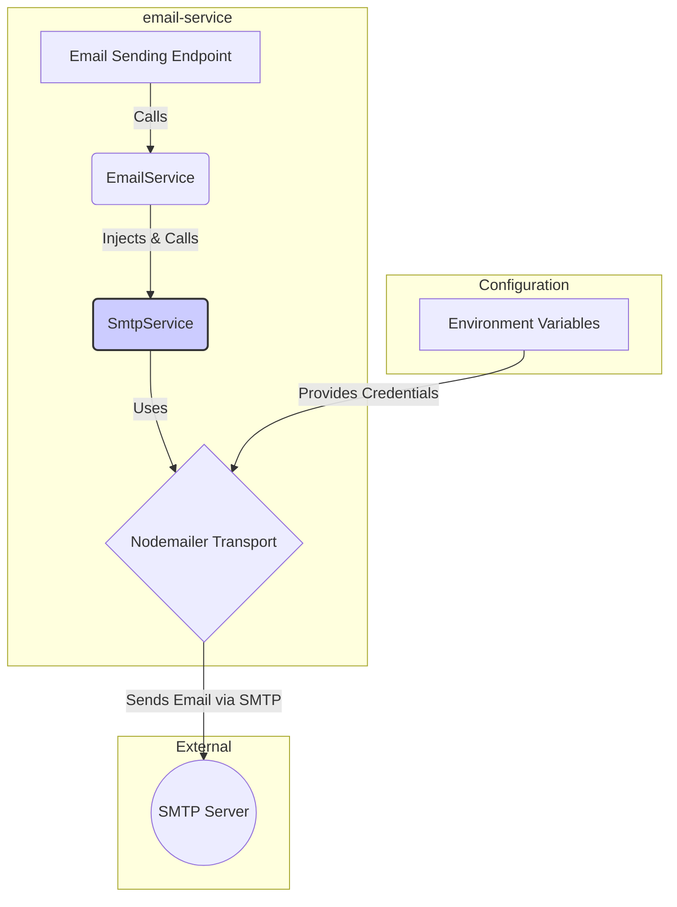

# Implementation Plan: Nodemailer Integration

## Goal

The goal is to integrate the `Nodemailer` library into the `email-service` application. This involves creating a dedicated `SmtpModule` to abstract away the complexities of SMTP communication. This module will provide a simple, injectable service (`SmtpService`) that other parts of the application can use to send emails, with configuration driven by environment variables for security and flexibility.

## Requirements

- Add `nodemailer` and its TypeScript definitions (`@types/nodemailer`) as dependencies.
- Create a new `SmtpModule` within the `email-service` application.
- Implement an `SmtpService` with a public `sendEmail` method.
- Configure the Nodemailer transport using environment variables (`SMTP_HOST`, `SMTP_PORT`, `SMTP_USER`, `SMTP_PASS`).
- Ensure the `SmtpService` can be mocked for unit testing.

## Technical Considerations

### System Architecture Overview

This integration introduces a new module, `SmtpModule`, which acts as a wrapper around the Nodemailer library. It follows Nest.js conventions for modularity and dependency injection.



- **Technology Stack Selection**:
  - **Nodemailer**: A mature and widely-used Node.js library for sending emails. It's a perfect choice for its robustness, feature set (including SMTP support, connection pooling, and security options), and strong community support.
  - **Nest.js Modules**: We will use Nest.js's module system to create a `DynamicModule`. This allows the `SmtpModule` to be configured at runtime (e.g., loading credentials from a config service) and makes the `SmtpService` available for dependency injection throughout the application.

- **Integration Points**:
  - **Configuration Management**: The `SmtpModule` will integrate with a configuration service (like `@nestjs/config`) to securely load SMTP credentials from environment variables. This decouples the service from the configuration source.
  - **Application Core**: The `SmtpService` will be injected into higher-level services, such as the main `EmailService`, which will orchestrate the business logic of sending an email.

- **Scalability Considerations**: Nodemailer's transport object supports connection pooling, which is efficient for handling multiple concurrent requests. By encapsulating the transport within a singleton `SmtpService` provided by Nest.js, we ensure that the connection is managed effectively across the application.

### File Structure

The following files will be created within `apps/email-service/src/`:

```sh
smtp/
├── smtp.module.ts
├── smtp.service.ts
└── interfaces/
    └── mail-options.interface.ts
```

### Implementation Details

1. **`smtp.module.ts`**:
   - This will be a Nest.js `DynamicModule`.
   - It will use the `@nestjs/config` module to read environment variables.
   - It will create and configure the Nodemailer transport object.
   - It will provide the `SmtpService`.

2. **`smtp.service.ts`**:
   - This service will be injectable.
   - It will have a constructor that receives the configured Nodemailer transport instance.
   - It will expose a `public async sendEmail(options: Mail.Options)` method that calls `transport.sendMail(options)`.

3. **`mail-options.interface.ts`**:
   - This will re-export Nodemailer's `Mail.Options` interface to provide a consistent type within the application.

4. **Environment Variables**:
   - The application's configuration will be updated to require and validate `SMTP_HOST`, `SMTP_PORT`, `SMTP_USER`, and `SMTP_PASS`.

### Security & Performance

- **Security**:
  - All SMTP credentials will be loaded from environment variables and never hard-coded.
  - The `SmtpModule` will ensure that the connection to the SMTP server uses TLS by setting `secure: true` in the transport options (when `SMTP_PORT` is 465).
- **Performance**:
  - The Nodemailer transport will be created once when the module initializes and reused for all subsequent email sending operations, leveraging connection pooling.
- **Testability**:
  - By encapsulating the Nodemailer logic in the `SmtpService`, we can easily mock this service in unit tests for any consuming service (like `EmailService`). We can create a mock provider that replaces `SmtpService` with a fake implementation that simulates success or failure without making network calls.
