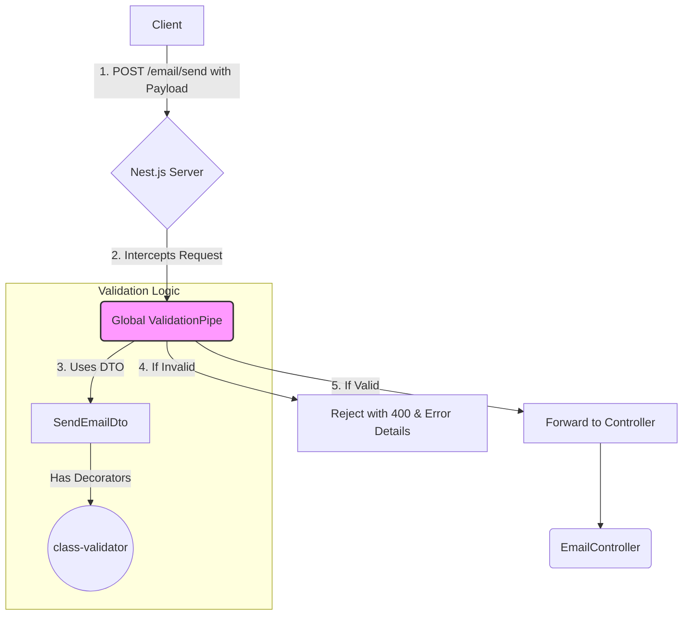

# Implementation Plan: Request Validation

## Goal

To implement a robust and automatic request validation system for the `email-service` API. This will be achieved by leveraging Nest.js's built-in `ValidationPipe` in conjunction with `class-validator` decorators on Data Transfer Objects (DTOs). This ensures all incoming data to the `POST /email/send` endpoint is well-formed, complete, and secure.

## Requirements

- Define a `SendEmailDto` with validation rules for `to`, `subject`, and `body`.
- Use `class-validator` decorators (`@IsEmail`, `@IsString`, `@IsNotEmpty`) to enforce the rules.
- Configure the `ValidationPipe` globally to automatically validate all incoming requests against their DTOs.
- The pipe must be configured to `whitelist` properties (strip out any not in the DTO) and `forbidNonWhitelisted` properties (throw an error if unexpected properties are present).
- Ensure that validation failures automatically trigger a `400 Bad Request` response with a detailed error message.

## Technical Considerations

### System Architecture Overview

Request validation is a cross-cutting concern that is handled early in the Nest.js request lifecycle. By applying the `ValidationPipe` globally, we ensure that no request reaches the business logic (services and controllers) without first passing validation.



- **Technology Stack Selection**:
  - **Nest.js `ValidationPipe`**: The canonical way to handle validation in Nest.js. It's powerful, configurable, and integrates seamlessly into the framework.
  - **`class-validator`**: A decorator-based library that provides a rich set of validation rules. It's the engine that powers the `ValidationPipe`.
  - **`class-transformer`**: Works alongside `class-validator` to transform plain request objects into typed DTO instances.

- **Integration Points**:
  - **Global Application Level**: The `ValidationPipe` will be applied globally in `main.ts` using `app.useGlobalPipes()`. This is the most effective way to ensure all endpoints are protected.
  - **Controller Level**: The `SendEmailDto` is used as a type hint in the `EmailController`'s method signature, which is how the `ValidationPipe` knows which DTO to use for validation.

### File Structure

The implementation primarily involves two files:

```sh
apps/email-service/src/
├── email/
│   └── dto/
│       └── send-email.dto.ts  // Defines the validation rules
└── main.ts                    // Configures the global pipe
```

### Implementation Details

1. **Install Dependencies**:
   - `class-validator` and `class-transformer` are typically included when generating a new Nest.js project. If not, they must be installed.

   ```sh
   npm install class-validator class-transformer
   ```

2. **`send-email.dto.ts`**:
   - This file defines the data contract for the `/email/send` endpoint.

   ```typescript
   import { IsEmail, IsNotEmpty, IsString } from 'class-validator';

   export class SendEmailDto {
     @IsEmail({}, { message: 'A valid email address must be provided for the "to" field.' })
     @IsNotEmpty({ message: 'The "to" field cannot be empty.' })
     to: string;

     @IsString()
     @IsNotEmpty()
     subject: string;

     @IsString()
     @IsNotEmpty()
     body: string;
   }
   ```

   *(Note: Custom error messages are added for clarity).*

3. **`main.ts`**:
   - This is where the `ValidationPipe` is configured and applied globally.

   ```typescript
   import { NestFactory } from '@nestjs/core';
   import { AppModule } from './app.module';
   import { ValidationPipe } from '@nestjs/common';

   async function bootstrap() {
     const app = await NestFactory.create(AppModule);

     app.useGlobalPipes(
       new ValidationPipe({
         whitelist: true, // Strips properties that do not have any decorators
         forbidNonWhitelisted: true, // Throws an error if non-whitelisted values are provided
         transform: true, // Automatically transform payloads to be objects typed according to their DTO classes
       }),
     );

     await app.listen(3000);
   }
   bootstrap();
   ```

### Security & Performance

- **Security**:
  - **Preventing Mass Assignment Vulnerabilities**: By using `whitelist: true` and `forbidNonWhitelisted: true`, we prevent clients from injecting unexpected or malicious properties into our data objects. For example, a client cannot pass an `isAdmin: true` field if it's not defined in the DTO.
  - **Type Safety**: The pipe ensures that the data reaching our service layer is of the correct type, preventing a class of errors and potential vulnerabilities.
- **Performance**:
  - The validation process is extremely fast and runs in-memory. The performance overhead is negligible and is a standard, accepted cost for the significant security and reliability benefits it provides.
