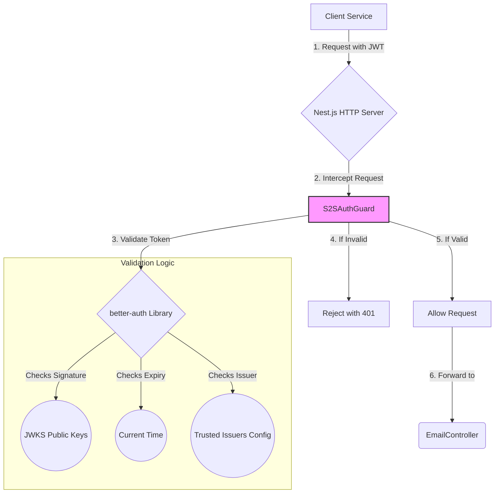

# Implementation Plan: Service-to-Service Authentication

## Goal

To secure the `email-service` API by implementing a robust service-to-service (S2S) authentication mechanism. This will be achieved by integrating the in-house `@my-org/better-auth` library and creating a Nest.js guard to protect all API endpoints. Only requests from trusted internal services presenting a valid JWT will be processed.

## Requirements

- Add the `@my-org/better-auth` package as a dependency.
- Create a new `S2SAuthGuard` that implements the `CanActivate` interface.
- The guard must use the `better-auth` library to validate incoming JWTs from the `Authorization` header.
- The guard must be applied globally or to the `EmailController` to protect all its routes.
- Invalid, expired, or missing tokens must result in a `401 Unauthorized` response.

## Technical Considerations

### System Architecture Overview

This implementation introduces a security layer into the request pipeline of the Nest.js application. The `S2SAuthGuard` will intercept all incoming requests to protected endpoints before they reach the controller logic.



- **Technology Stack Selection**:
  - **Nest.js Guards**: The ideal choice for implementing authentication in a Nest.js application. Guards are executed before the route handler and determine whether a given request will be handled by the route handler or not.
  - **`@my-org/better-auth`**: The organization's standard library for S2S authentication. Using it ensures consistency, security, and leverages pre-existing logic for token validation, including fetching and caching of JWKS (JSON Web Key Sets).

- **Integration Points**:
  - **Nest.js Request Pipeline**: The `S2SAuthGuard` will be a key component in the application's request lifecycle.
  - **Configuration**: The guard will likely need configuration from the application's central config service to determine the expected issuer or other token claims.

- **Scalability Considerations**: The `better-auth` library is assumed to be built for performance, likely caching public keys to avoid repeated lookups for every request. As a result, the performance impact of the authentication check should be negligible and scale with the application.

### File Structure

The following files will be created/modified within `services/my-nest-js-email-microservice/src/`:

```sh
auth/
└── s2s-auth.guard.ts  // The new guard implementation
email/
└── email.controller.ts // Modified to apply the guard
```

### Implementation Details

1. **Install Dependency**:

   ```sh
   pnpm -w install @my-org/better-auth
   ```

2. **`s2s-auth.guard.ts`**:
   - Create a class `S2SAuthGuard` that implements `CanActivate`.
   - Inject the validation service provided by `@my-org/better-auth`.
   - In the `canActivate` method:
     - Extract the request object from the `ExecutionContext`.
     - Retrieve the JWT from the `Authorization: Bearer <token>` header.
     - If no token is present, return `false` or throw an `UnauthorizedException`.
     - Call the `better-auth` validation method with the token.
     - The validation method should handle signature, expiry, and issuer checks.
     - Return `true` if the token is valid, `false` otherwise.

3. **`email.controller.ts`**:
   - Apply the guard to the entire controller using the `@UseGuards` decorator.

   - ```typescript
     @UseGuards(S2SAuthGuard)
     @Controller('email')
     export class EmailController { ... }
     ```

### Security & Performance

- **Security**:
  - We are delegating the core JWT validation logic to the specialized `@my-org/better-auth` library, which is assumed to be vetted and secure.
  - The guard will prevent any unauthenticated access to the service's business logic.
- **Performance**:
  - The guard adds a single, fast check to the request lifecycle. The performance overhead is expected to be minimal, especially with public key caching handled by the auth library.
- **Testability**:
  - The `S2SAuthGuard` can be easily mocked in unit tests for the `EmailController` by using Nest.js's `overrideGuard` method in the `TestBed`.
  - Integration tests should be written to cover the authentication flow with real and invalid tokens to ensure the guard is working correctly in the request pipeline.
