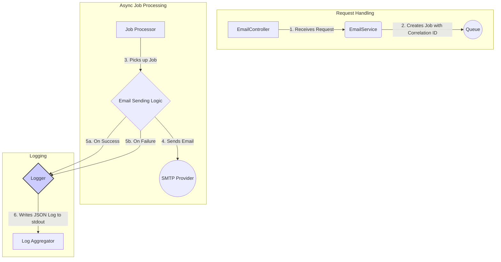

# Implementation Plan: Status Logging

## Goal

To implement comprehensive, structured logging for the `my-nest-js-email-microservice`. This will provide clear visibility into the outcome of every email-sending attempt, enabling effective monitoring, debugging, and alerting. The implementation will use a standard logging library (like Winston or Pino) and ensure all log entries are in a machine-readable JSON format.

## Requirements

- Integrate a structured logging library (e.g., Nest.js's built-in `Logger` extended for JSON, or a library like `pino`).
- Log the outcome (`SUCCESS` or `FAILURE`) of every email job.
- Logs must be in JSON format.
- Success logs must include the `messageId` from the SMTP provider.
- Failure logs must include a detailed error message.
- Implement a correlation ID mechanism to trace a single request across all logs.

## Technical Considerations

### System Architecture Overview

Logging will be implemented as a core part of the `EmailService` and the asynchronous job processor. A custom logger or a pre-configured library will be used to format logs as JSON and send them to `stdout`, where they can be collected by a log aggregator (like Fluentd or Logstash).



- **Technology Stack Selection**:
  - **Nest.js `Logger`**: Nest.js comes with a built-in logger that can be extended to produce JSON-formatted logs. This is a good starting point as it's well-integrated with the framework.
  - **`pino` (Alternative)**: A high-performance logging library for Node.js that is purpose-built for JSON logging. If the default logger is not sufficient, `pino` (with `nestjs-pino`) is the industry-standard choice.
  - **Correlation ID**: A middleware or interceptor can be used to generate a unique ID for each incoming request (e.g., using the `uuid` library) and attach it to the request object, making it available throughout the request's lifecycle.

- **Integration Points**:
  - **Asynchronous Processor**: The logging logic will be most critical within the job handler that processes emails from the queue.
  - **Log Aggregation System**: The application will simply write JSON logs to standard output. It is the responsibility of the container/platform environment (e.g., Kubernetes with a Fluentd sidecar) to collect, parse, and forward these logs to a centralized system like Elasticsearch or Datadog.

### File Structure

```plaintext
services/my-nest-js-email-microservice/src/
├── common/
│   └── logging/
│       ├── custom-logger.service.ts # Custom logger implementation
│       └── correlation-id.middleware.ts # Middleware to add correlation ID
├── email/
│   └── email.processor.ts       # Where the logging calls will be made
└── main.ts                        # Where middleware is applied
```

### Implementation Details

1. **`correlation-id.middleware.ts`**:
    - Create a Nest.js `Middleware` that generates a unique ID for each request.
    - Use a library like `uuid` to generate the ID.
    - Attach the ID to the request object (e.g., `request.id = generatedId`).

2. **`custom-logger.service.ts`**:
    - Extend the built-in `ConsoleLogger` from `@nestjs/common`.
    - Override methods like `log()` and `error()` to format the output as JSON.
    - The logger should be able to access the current request's correlation ID (e.g., via `AsyncLocalStorage` or by being request-scoped).

    ```typescript
    // Example of a custom log method
    log(message: string, context?: string) {
      const correlationId = this.getCorrelationId(); // Logic to get ID
      const logObject = {
        level: 'info',
        message,
        context,
        correlationId,
        timestamp: new Date().toISOString(),
      };
      super.log(JSON.stringify(logObject));
    }
    ```

3. **`email.processor.ts` (or `email.service.ts`)**:
    - Inject the custom logger.
    - In the `try/catch` block for sending an email:
      - On success, call `logger.log()` with the success message and `messageId`.
      - On failure, call `logger.error()` with the failure message and the error object.

    ```typescript
    try {
      const result = await this.smtpService.sendEmail(job.data);
      this.logger.log('Email sent successfully', { messageId: result.messageId });
    } catch (error) {
      this.logger.error('Failed to send email', { error: error.message });
    }
    ```

4. **`main.ts`**:
    - Apply the `CorrelationIdMiddleware` to all routes using `app.use()`.
    - Set the application's default logger to be an instance of the `CustomLogger`.

### Security & Performance

- **Security**:
  - The logger must be configured to automatically redact or censor sensitive information in log payloads, such as passwords, API keys, or personally identifiable information (PII). While the `SendEmailDto` is simple, this is a critical best practice.
- **Performance**:
  - Logging should be asynchronous or use highly efficient, non-blocking I/O to avoid slowing down the main application thread. Libraries like `pino` are specifically designed for this. Writing to `stdout` is generally very fast.
